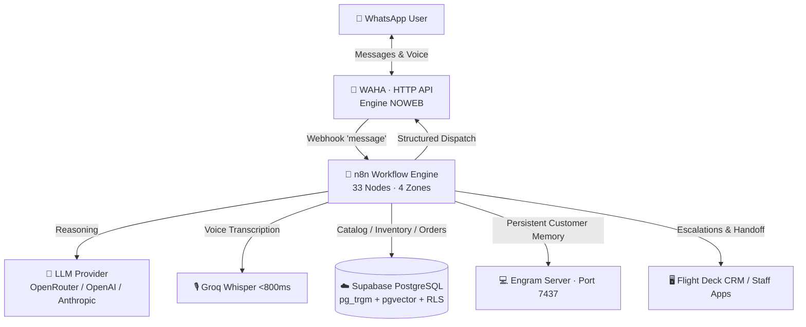

# 🏛️ Enterprise WhatsApp AI Sales Agent — System Architecture

An in-depth architectural guide for deploying an autonomous, production-ready WhatsApp AI Sales and Customer Support Agent with local orchestration, hybrid RAG retrieval, and real-time flight deck monitoring.

---

## 1. Overview & Architectural Philosophy

Traditional AI chatbots often rely on costly serverless API gateways, expensive recurring VPS servers, and naive single-prompt LLM wrappers that hallucinate prices and stock.

This project implements a **Clean, Event-Driven, Multi-Layer Architecture**:
- **Data Sovereignty & Local Orchestration**: Core reasoning and orchestration run locally (via Docker / n8n / WAHA), eliminating recurring middleman infrastructure costs.
- **5-Layer Hybrid Retrieval (RAG)**: Combines deterministic lexical matching, catalog synonym dictionaries, fuzzy trigrams, pgvector cosine embeddings, and LLM semantic recovery to achieve sub-second lookup across thousands of SKUs.
- **Fail-Safe Human Handoff**: Detects ambiguous intents, negative feedback, or employee intervention via WhatsApp, seamlessly transferring conversations to human staff without message loss.
- **Dynamic White-Labeling**: Business policies, agent personas, working hours, currencies, and dispatch rules are fully decoupled into environment variables (`.env`) and modular configuration files.

---

## 2. The 5-Layer Hybrid Search Pipeline (RAG)

Customers query products in natural conversational language (*"the glue for PVC pipes"*, *"gray cement 1/2"*), which rarely matches official catalog titles. The search engine executes a multi-layer cascade:

| # | Layer | Implementation | Purpose & Tradeoffs |
| :- | :--- | :--- | :--- |
| **1** | **Deterministic Lexical** | AST normalizer, dimension parser (`2x1`, `1-1/2"`), custom stopword filtering | Resolves ~70% of standard queries in under 50ms with zero LLM API cost. |
| **2** | **Catalog Dictionary** | Inverted synonym map (`catalogo_vocabulario`) | Handles regional slang and colloquial product names (e.g. *chapa* → lock). |
| **3** | **Fuzzy Trigram (`pg_trgm`)** | PostgreSQL GIN index with similarity thresholds | Recovers from misspellings and single-character typos. |
| **4** | **Vector Search (`pgvector`)** | `text-embedding-3-small` cosine distance (<0.45) | Captures semantic phrasing variations. Optional layer; safely falls back if disabled. |
| **5** | **Semantic Recovery** | Structured LLM prompt over category taxonomies | Discovers intent when customers describe product *function* rather than name. Successful hits feed Layer 2. |
| **★** | **Sales Popularity Reranking**| Historical purchase frequency weighting | Prioritizes frequently purchased items over stale catalog entries. |

---

## 3. Workflow Orchestration in n8n (4 Logical Zones)

The n8n workflow processes inbound WhatsApp webhooks through 4 decoupled zones:

1. **Zone 01 — Ingestion & Deduplication**:
   - Immediate HTTP 200 acknowledgment to WAHA (<15ms).
   - Redis/in-memory message ID deduplication to prevent duplicate webhook processing.
   - Token bucket rate limiting and `fromMe` employee intervention detection.

2. **Zone 02 — Pre-Processing & Audio Stream**:
   - Media switch detecting text vs voice messages.
   - Voice note transcription via Groq Whisper in <800ms.
   - Debounce buffer (3-second window) for burst messages.
   - Session state loading from Supabase.

3. **Zone 03 — Hybrid Routing & Tools**:
   - Intent classification router (General inquiry, product query, quotation, support).
   - Execution of `buscar_productos` or `hacer_presupuesto`.
   - Tool calling with strict no-hallucination constraints.

4. **Zone 04 — Structured Dispatch & CRM Integration**:
   - Output markdown normalization (enforcing single `*` for WhatsApp bold formatting).
   - Direct database dispatch to `atenciones_pendientes` and `solicitudes_ayuda`.
   - Outbound HTTP call to WAHA API for message transmission.

---

## 4. Security, Isolation & Row-Level Security (RLS)

- **Principle of Least Privilege**: The agent interacts with the PostgreSQL database using a restricted database role (`agent_readonly`).
- **Data Protection**: Direct mutations (`INSERT`, `UPDATE`, `DELETE`) on core inventory tables are prohibited from the agent connection.
- **Rate Limiting**: Prevents denial-of-service or bot spam via per-phone rate limiting windows in `chat_sessions`.

---

## 5. Operations & Flight Deck CRM

The companion Next.js application (`dashboard/`) provides real-time operational visibility:
- **Live Terminal & RAG Studio**: Allows developers and administrators to simulate queries and inspect hit layers, latencies, and token costs in real time.
- **Customer Attention Queue**: Visualizes conversations requiring human escalation or delivery coordination.
- **PWA & Offline Capability**: Installable Progressive Web App for mobile and desktop management.
