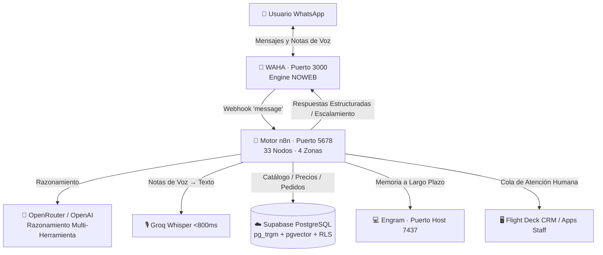
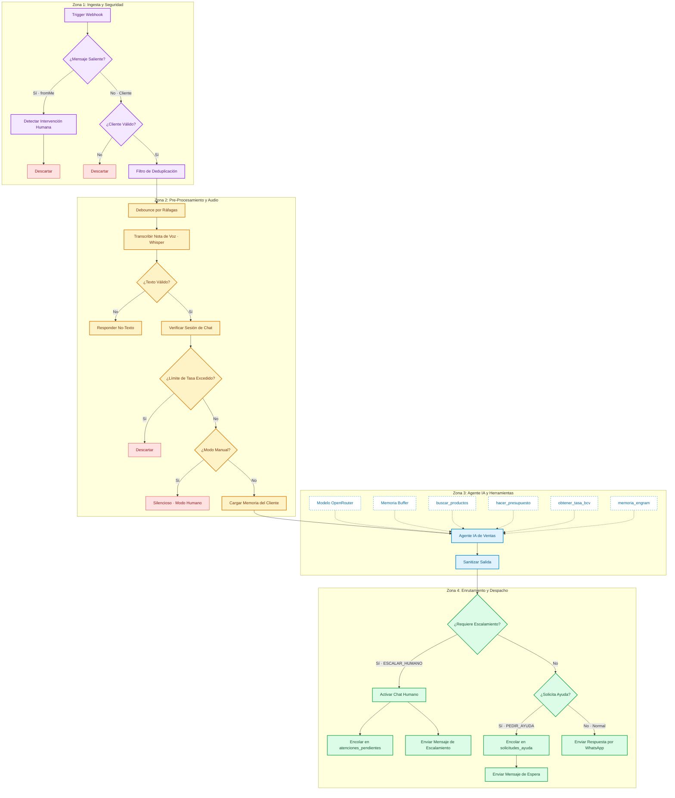

<div align="center">

  

  # Agente de Ventas IA para WhatsApp

  <p align="center">
    <strong>Motor autónomo de ventas y atención al cliente para WhatsApp de nivel de producción.</strong><br>
    Búsqueda híbrida en 5 capas, transcripción de notas de voz en &lt;800ms, memoria persistente y escalamiento a humanos.
  </p>

  <p align="center">
    <a href="README.md"><strong>English</strong></a> · <a href="README.es.md"><strong>Español</strong></a>
  </p>

  <p align="center">
    <a href="https://nodejs.org/"></a>
    <a href="https://www.docker.com/"></a>
    <a href="https://n8n.io/"></a>
    <a href="https://supabase.com/"></a>
    <a href="https://nextjs.org/"></a>
    <a href="LICENSE"></a>
  </p>

</div>

---

## 🏗️ Arquitectura

Basada en eventos. Los mensajes de WhatsApp llegan a través de WAHA, n8n orquesta con LLMs vía OpenRouter, consulta PostgreSQL en Supabase y almacena la memoria de clientes mediante Engram.



### 🧰 Stack Tecnológico

| Componente | Tecnología | Propósito |
| --- | --- | --- |
| HTTP API WhatsApp | WAHA (Docker, motor NOWEB) | Emulación de sesiones multidispositivo y despacho de webhooks |
| Orquestador de Flujos | n8n (Docker) | Gestión de eventos, enrutamiento de estado, rate limiting y despacho de herramientas |
| Razonamiento LLM | OpenRouter / OpenAI | Razonamiento multiturno e invocación de herramientas |
| Transcripción de Voz | Groq Whisper | Transcripción de notas de audio en <800ms |
| Base de Datos y Búsqueda | Supabase (PostgreSQL + pg_trgm + pgvector) | Catálogo de inventario, cola de pedidos y búsqueda vectorial híbrida |
| Memoria a Largo Plazo | Engram | Hechos y preferencias persistentes de clientes entre sesiones |
| Flight Deck & CRM | Next.js 14 (App Router + Tailwind + GSAP + PWA) | Telemetría en vivo, cola de operaciones de chat, estudio RAG, consola DevOps |
| Runtime | Node.js 22+ | Herramientas de CLI, guardias de sincronización, motor de recuperación |

---

## 🔍 El Pipeline de Búsqueda Híbrida de 5 Capas (RAG)

| # | Capa | Implementación | Qué Resuelve |
| --- | --- | --- | --- |
| 1 | AST Léxico | ilike + parseador de dimensiones (NxM, fracciones, calibre) | Consultas base en ~50ms sin costo de API (~70% del volumen) |
| 2 | Diccionario de Catálogo | Tabla de sinónimos invertida (catalogo_vocabulario) | Jerga regional y coloquialismos |
| 3 | Trigramas Fuzzy | Índices de similitud GIN de pg_trgm | Errores ortográficos graves, letras traspuestas |
| 4 | Búsqueda Vectorial | Similitud coseno con pgvector (text-embedding-3-small) | Variaciones en la redacción |
| 5 | Recuperación Semántica | Clasificación de categorías y extracción de intención por LLM | Cliente describe la función de un producto |
| ★ | Popularidad de Ventas | Frecuencia de compra ponderada | Reordena resultados según histórico de ventas |

Ver [RAG.md](RAG.md) y [ARCHITECTURE.md](ARCHITECTURE.md) para detalles profundos de arquitectura.

---

## 🖥️ Flight Deck CRM & Dashboard de Operaciones

<div align="center">
  
  <p align="center"><em>Previsualización interactiva de la consola de operaciones y CRM en tiempo real.</em></p>
</div>

<br />

<table border="0">
  <tr>
    <td width="30%" align="center" valign="middle">
      
    </td>
    <td width="70%" valign="top">
      El directorio <code>dashboard/</code> contiene una aplicación complementaria completa desarrollada en Next.js 14:
      <ul>
        <li><strong>Flight Deck</strong>: Telemetría del agente en tiempo real (latencia, costos de tokens, mapa de microservicios, logs en streaming).</li>
        <li><strong>WhatsApp CRM</strong>: Espacio de trabajo de chat en vivo con detalles de prospectos, respuestas manuales y modo silencioso.</li>
        <li><strong>RAG Studio</strong>: Terminal de pruebas interactivo para inspeccionar el motor de búsqueda en 5 capas en tiempo real.</li>
        <li><strong>Visualizador n8n</strong>: Mapa topológico interactivo de nodos en las 4 zonas de ejecución.</li>
        <li><strong>Consola DevOps</strong>: Terminal de operaciones de infraestructura y monitoreo de túneles.</li>
      </ul>
    </td>
  </tr>
</table>

**Capacidades Principales y Herramientas:**
* **Autenticación**: Supabase Auth con Modo Demo instantáneo para exploración sin credenciales.
* **Progressive Web App (PWA)**: Instalable en escritorio y móviles, soporte offline con service workers y alertas web push VAPID.
* **UI/UX Moderna**: Tema oscuro lava/obsidiana, animaciones GSAP, tipografía Space Grotesk + JetBrains Mono, fondo de radar arquitectónico.
* **Full Stack & Pruebas**: Next.js 14, React 18, Tailwind CSS, íconos Lucide, pruebas unitarias con Vitest y suites E2E con Playwright.
* **Endpoints API**: `/api/conversations`, `/api/n8n`, `/api/rag`, `/api/telemetry` y `/api/tunnel`.

---

## 🤝 Sistema de Escalamiento Humano y Solicitudes de Ayuda
- **Cola de Atención** (`atenciones_pendientes`): Cuando un cliente pide hablar con un agente humano, el bot lo encola. Los empleados ven notificaciones instantáneas mediante Supabase Realtime. Una atención pendiente por teléfono (deduplicación). Protegido por RLS.
- **Solicitudes de Ayuda** (`solicitudes_ayuda`): Cuando el bot no encuentra un producto o el cliente objeta el resultado, se genera una solicitud. Los empleados seleccionan los productos correctos y n8n envía automáticamente la respuesta corregida al cliente por WhatsApp. Flujo: pendiente → resuelto → enviado.
- **Notificaciones Web Push**: Envíos push basados en VAPID al personal incluso con la app cerrada, mediante Supabase Edge Functions.

---

## 🗺️ Topología de Flujos n8n (4 Zonas)



---

## ⚙️ Flujos Auxiliares de n8n

| Flujo | Archivo | Propósito |
| --- | --- | --- |
| Auto-Mejora | `workflows/workflow_automejora.json` | Analiza fallos del agente y parchea automáticamente el prompt o la lógica de búsqueda |
| Reenvío de Ayuda | `workflows/workflow_reenviar_ayuda.json` | Redacta y envía mensajes con productos corregidos al cliente tras la resolución humana |
| Generador de Vocabulario | `workflows/workflow_vocabulario.json` | Genera y actualiza el diccionario de sinónimos del catálogo a partir de patrones de consulta |

---

## 🗄️ Esquema de Base de Datos
PostgreSQL en Supabase con RLS. Tablas clave:
- `productos` — Catálogo de productos (SKU, descripción, precio, stock, código de barras)
- `tazas` — Tasas de cambio dinámicas (BCV USD/EUR, Binance P2P)
- `clientes` — Registro de clientes
- `chat_sessions` — Estado bot/humano y rate limiting por número telefónico
- `ventas` / `ventas_detalle` — Transacciones de venta
- `ordenes_cambio` / `ordenes_cambio_items` — Ajustes de inventario
- `atenciones_pendientes` — Cola de escalamiento humano (Habilitado con Realtime)
- `solicitudes_ayuda` / `solicitudes_ayuda_items` — Cola de ayuda (Habilitado con Realtime)
- `push_subscriptions` — Suscripciones a notificaciones Web Push
- `servidores_tuneles` — Registro de URLs dinámicas de túneles Cloudflare

Características clave: Índices GIN pg_trgm, búsqueda coseno con pgvector, políticas RLS (anon para bot, autenticado para empleados), suscripciones Supabase Realtime, funciones SECURITY DEFINER.

---

## ⚡ Inicio Rápido y Configuración

### 1. Clonar y Configurar
```bash
git clone https://github.com/Gus2708/whatsapp-agent.git
cd whatsapp-agent
cp .env.example .env
```
Editar `.env` con los datos de tu empresa (AGENT_NAME, STORE_NAME, STORE_LOCATION, STORE_SCHEDULE, STORE_CURRENCY) y llaves API (WAHA_API_KEY, OPENROUTER_API_KEY, GROQ_API_KEY, SUPABASE_URL, SUPABASE_ANON_KEY, opcionalmente OPENAI_API_KEY para embeddings pgvector).

### 2. Iniciar Servicios con Docker
```bash
docker compose up -d
```
- Dashboard WAHA: http://localhost:3000 (escanear código QR)
- Automatización n8n: http://localhost:5678

### 3. Iniciar el Dashboard Flight Deck CRM
```bash
cd dashboard && npm install
npm run dev
```
Abrir http://localhost:3001. Configurar `dashboard/.env.local` tomando como base `dashboard/.env.example`.

### 4. Aplicar Esquema de Base de Datos
Ejecutar `supabase_schema.sql` en el editor SQL de tu panel de Supabase.

### 5. Generar Embeddings (opcional, para capa pgvector)
```bash
node scripts/generar_embeddings.js
```

---

## 🧩 Fuente Única de Verdad y Protección contra Desviaciones
El motor de búsqueda principal reside canónicamente en `lib/catalog-search.js`. Protegido por:
```bash
npm test
```
- `check_sources_sync.js` — verifica que lib/catalog-search.js coincida con scripts y dumps en vivo
- `check_workflow_sync.js` — verifica que n8n_workflow.json coincida con el prompt del sistema y nodos de búsqueda
- Dashboard: Verificación estricta en TypeScript + pruebas unitarias con Vitest + suites E2E con Playwright
- Pruebas en raíz: búsqueda en catálogo, guardia de workflow, entornos declarados, búsqueda de pinturas/láminas, flujo de recuperación

---

## 🌿 Ramas e Implementaciones de Referencia
- **`master`** (Por defecto): Plantilla open-source 100% marca blanca
- **`perucho`**: Implementación de referencia para Ferretería El Serrucho (ferretería en Venezuela)

---

## 📁 Estructura del Repositorio

| Ruta | Propósito |
| --- | --- |
| `dashboard/` | Dashboard Flight Deck CRM & Operaciones en Next.js (5 vistas, PWA, Supabase Auth) |
| `dashboard/components/crm/` | Espacio CRM: lista de conversaciones, ventana de chat, datos del cliente |
| `dashboard/components/rag/` | RAG Studio: terminal interactivo para pruebas de búsqueda |
| `dashboard/components/telemetry/` | Matriz de KPIs, flujo de logs en vivo, topología de microservicios |
| `dashboard/components/devops/` | Consola DevOps |
| `dashboard/components/auth/` | Proveedor de Auth + pantalla de login (Supabase Auth + Modo Demo) |
| `dashboard/components/pwa/` | Registro de service worker PWA |
| `dashboard/app/api/` | Rutas API de Next.js (conversaciones, n8n, rag, telemetría, túnel) |
| `lib/catalog-search.js` | Motor de búsqueda canónico y normalizador AST |
| `rag.js` | Ejecutor de suites de evaluación RAG |
| `scripts/` | Más de 120 scripts operativos: parches, pruebas, constructores de flujos, generadores de embeddings |
| `workflows/` | Flujos auxiliares de n8n (auto-mejora, reenvío de ayuda, vocabulario) |
| `n8n_workflow.json` | Exportación completa del flujo del agente principal en n8n |
| `data/business_context.example.json` | Plantilla para reglas de negocio personalizadas, horarios, zonas de entrega |
| `docker-compose.yml` | Definición de contenedores para WAHA y n8n |
| `supabase_schema.sql` | Esquema completo de PostgreSQL con RLS, triggers y funciones |
| `boot.ps1` / `catchup.ps1` | Ejecutor en segundo plano y motor de recuperación de mensajes offline |
| `waha_watchdog.ps1` | Monitoreo y auto-recuperación de la sesión de WAHA |
| `tests/` | Suite de pruebas Node.js test:test (catálogo, workflow, recuperación, etc.) |
| `ARCHITECTURE.md` | Libro blanco detallado de arquitectura |
| `RAG.md` | Benchmarks de ingeniería y optimización del pipeline RAG |
| `.env.example` | Plantilla de variables de entorno en raíz |

---
