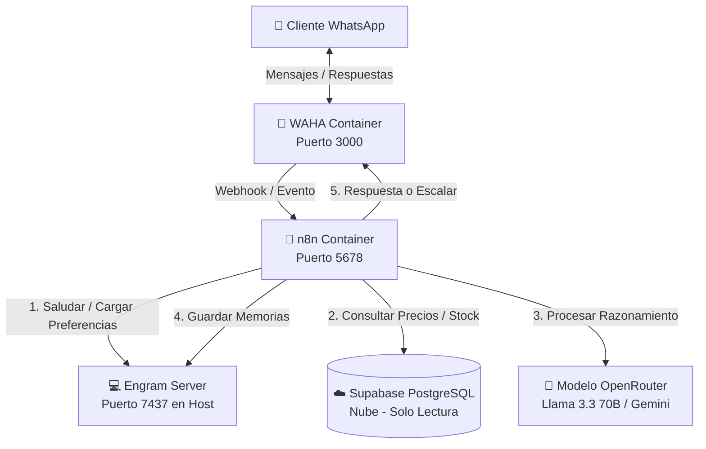

# 🪚 Agente de Inteligencia Artificial para WhatsApp - Ferretería El Serrucho

Este repositorio contiene la solución completa de orquestación local para automatizar la atención al cliente, consulta de inventario en tiempo real, cotizaciones exactas y retención personalizada para la **Ferretería El Serrucho**, ubicada en **Mene Mauroa, Estado Falcón**.

El sistema aprovecha tecnologías locales modernas y base de datos relacional segura en la nube para ofrecer un asistente autónomo ("Perucho") sin incurrir en costos recurrentes de infraestructura en la nube.

---

## 🏗️ Arquitectura del Ecosistema

La topología del sistema sigue una arquitectura dirigida por eventos (Event-Driven Architecture) local:



---

## 🚀 Requisitos del Sistema (PC Servidor)

*   **Sistema Operativo:** Windows 10/11 (Recomendado) o Linux/macOS.
*   **Procesador:** CPU de 4 núcleos o superior.
*   **Memoria RAM:** Mínimo 8 GB (16 GB Recomendado para mejor fluidez de contenedores).
*   **Almacenamiento:** 50 GB libres en SSD.

---

## 🛠️ Instalación Rápida (Un solo paso)

Hemos creado un instalador automatizado en Javascript (`setup.js`) que verifica e instala todas las herramientas necesarias por vos.

1.  **Clona este repositorio** en tu máquina local:
    ```bash
    git clone https://github.com/tu-usuario/whatsapp-agent.git
    cd whatsapp-agent
    ```
2.  **Ejecuta el script de configuración:**
    ```bash
    npm run setup
    ```
    *o directamente:*
    ```bash
    node setup.js
    ```

### ¿Qué hace el instalador automáticamente?
*   **Verifica Node.js** y sus componentes.
*   **Comprueba e instala Git** (si no lo tienes) usando el administrador oficial de Windows (`winget`).
*   **Comprueba e instala Docker Desktop** (si no lo tienes) usando `winget`.
*   **Descarga e instala el Servidor de Memorias Engram** en tu directorio de usuario (`%USERPROFILE%\.engram\bin`) y lo agrega automáticamente a las Variables de Entorno de Windows (`PATH`).
*   **Crea tu archivo `.env`** para que puedas configurar tus credenciales rápidamente.
*   **Permite levantar los contenedores Docker** (WAHA + n8n) inmediatamente si Docker ya está corriendo.

---

## ⚙️ Configuración del Sistema

### 1. Base de Datos en Supabase
1. Accede a tu consola de [Supabase](https://supabase.com/).
2. Ve al editor de SQL (**SQL Editor**) y ejecuta el script completo que se encuentra en:
   👉 [supabase_schema.sql](file:///g:/Projects/whatsapp-agent/supabase_schema.sql)
3. Esto configurará:
   *   La tabla `productos` con soporte de búsqueda difusa e indexación trigram (`pg_trgm`).
   *   La tabla de `clientes` y de `tasas` de cambio oficiales.
   *   Las funciones de búsqueda difusa relacional e historial de movimientos (`get_resumen_movimientos`).

### 2. Conexión de WhatsApp (WAHA)
1. Abre tu navegador en la dirección del panel de control de WAHA: **`http://localhost:3000`**
2. Inicia sesión con las credenciales configuradas en tu `docker-compose.yml` (por defecto: `admin_serrucho` / `REDACTED_WAHA_PASSWORD`).
3. Ve a **Sessions**, inicia una nueva sesión y escanea el código QR que se muestra con el celular de atención de la ferretería.

### 3. Flujo en n8n
1. Abre n8n en: **`http://localhost:5678`**
2. Ve al menú superior derecho y selecciona **Import from file...**
3. Elige el archivo:
   👉 [n8n_workflow.json](file:///g:/Projects/whatsapp-agent/n8n_workflow.json)
4. Configura tus credenciales:
   *   **Supabase Readonly** (Postgres): Añade los datos de conexión segura.
   *   **OpenRouter API**: Agrega tu clave API de OpenRouter para la inferencia del modelo LLM (Llama 3.3 70b u otro).
5. Activa el flujo presionando el interruptor **Active** (esquina superior derecha).

---

## 🏃‍♂️ Encendido del Ecosistema

Para levantar todos los servicios (el Servidor de Memorias local y los contenedores de WhatsApp/n8n), ejecuta el script de inicio orquestado:

```bash
npm start
```
*o desde PowerShell:*
```powershell
.\start_agent.ps1
```

### ¿Qué hace el script de encendido?
1.  Verifica si el puerto de **Engram (`7437`)** está libre. Si lo está, inicia el Servidor de Memorias en segundo plano con la zona horaria y configuraciones de Venezuela.
2.  **Sincroniza/Siembra automáticamente las memorias de comportamiento base** llamando a `seed_memory.js`.
3.  Levanta los contenedores de Docker en segundo plano (`waha_serrucho` y `n8n_serrucho`).
4.  Realiza un diagnóstico de salud (**healthcheck**) automático y te muestra qué servicios están corriendo correctamente.

---

## 📁 Estructura del Proyecto

*   **setup.js**: Script de instalación automatizada de dependencias y variables de entorno.
*   **seed_memory.js**: Script de siembra e inicialización de memorias base (idempotente) en Engram.
*   **start_agent.ps1**: Script PowerShell para encendido coordinado del sistema.
*   **waha_watchdog.ps1**: Watchdog que mantiene viva la sesión de WhatsApp (cada 3 min vía Task Scheduler).
*   **docker-compose.yml** & **Dockerfile**: Empaquetamiento de n8n con docker-cli y WAHA.
*   **n8n_workflow.json**: Flujo de trabajo del bot (20 nodos: filtro multimedia, rate limiting, AI agent, escalación).
*   **supabase_schema.sql**: Esquema DDL con 7 tablas, índices GIN/trigram y funciones RPC.
*   **.env.example**: Plantilla de variables de entorno (credenciales, URLs, claves).
*   **mcp_config.json**: Configuración MCP para Postgres readonly y Engram.
*   **scripts/**: Scripts de desarrollo, testing y patches (movidos desde la raíz para organización).
*   **data/**: Archivos de contexto del comercio.
*   **.agents/**: Reglas cognitivas del agente y habilidades específicas (`skills/advisor-serrucho/`).

---

## 🔒 Reglas de Negocio Incorporadas en Perucho
*   **Precios Directos**: Solo entrega el precio tal cual lo reporta la base de datos. Está estrictamente prohibido recalcular impuestos o agregar IVA.
*   **USD**: Todos los precios de venta son informados con el prefijo `$` y el sufijo `USD`.
*   **Retiro en Tienda**: Se informa de forma categórica que no hay envíos a domicilio; todo se retira en la tienda en **Mene Mauroa, Falcón**.
*   **Seguridad RLS**: La conexión a la base de datos se realiza con un rol exclusivo de lectura, bloqueando cualquier intento de inyección de instrucciones para alterar el stock o los precios.
*   **Memoria Engram**: Perucho reconoce a clientes habituales por su teléfono y recuerda sus métodos de pago predilectos, facturación RIF y cotizaciones pasadas.
*   **Rate Limiting**: Protección anti-flood de 10 mensajes por minuto por teléfono.
*   **Filtro Multimedia**: Solo se procesan mensajes de texto; imágenes, audios y stickers reciben respuesta amable.
