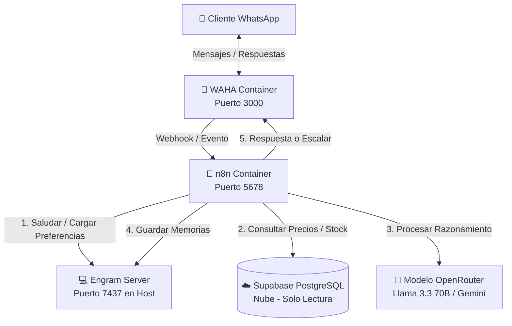

# 🪚 Agente WhatsApp con IA — Ferretería El Serrucho

[](https://nodejs.org/)
[](https://www.docker.com/)
[](LICENSE)
[](https://n8n.io/)

Solución completa de orquestación local para automatizar la atención al cliente, consulta de inventario en tiempo real, cotizaciones exactas y retención personalizada para la **Ferretería El Serrucho** (Mene Mauroa, Estado Falcón).

El sistema usa tecnología local moderna con base de datos relacional segura en la nube para ofrecer un asistente autónomo llamado **"Perucho"**, sin incurrir en costos recurrentes de infraestructura cloud.

---

## 🏗️ Arquitectura

La topología sigue una arquitectura orientada a eventos (Event-Driven) ejecutada completamente en local:



---

## 🧰 Stack Tecnológico

| Componente | Tecnología |
|---|---|
| WhatsApp HTTP API | [WAHA](https://waha.devlike.pro/) (Docker) |
| Orquestación de flujos | [n8n](https://n8n.io/) (Docker) |
| Base de datos | [Supabase](https://supabase.com/) (PostgreSQL + pg_trgm) |
| Memoria a largo plazo | [Engram](https://github.com/EngineVault/engram) |
| Inferencia LLM | [OpenRouter](https://openrouter.ai/) (Llama 3.3 70B / Gemini) |
| Runtime | Node.js 18+ |

---

## 🚀 Requisitos del Sistema

| Requisito | Mínimo | Recomendado |
|---|---|---|
| SO | Windows 10/11 | Windows 11 |
| CPU | 4 núcleos | 8 núcleos |
| RAM | 8 GB | 16 GB |
| Almacenamiento | 50 GB SSD | 100 GB SSD |

> **Nota:** Linux y macOS también son compatibles, pero los scripts `.ps1` y `.vbs` son exclusivos de Windows.

---

## 🛠️ Instalación Rápida

### 1. Clonar el repositorio

```bash
git clone https://github.com/Gus2708/whatsapp-agent.git
cd whatsapp-agent
```

### 2. Ejecutar el instalador

```bash
npm run setup
```

El script `setup.js` hace lo siguiente de forma automática:

- Verifica **Node.js** y sus componentes
- Instala **Git** via `winget` si no está disponible
- Instala **Docker Desktop** via `winget` si no está disponible
- Descarga e instala **Engram Server** en `%USERPROFILE%\.engram\bin` y lo agrega al `PATH`
- Crea tu archivo `.env` a partir de `.env.example`
- Levanta los contenedores Docker (WAHA + n8n) si Docker ya está corriendo

---

## ⚙️ Configuración

### 1. Variables de entorno

Copia `.env.example` a `.env` y completa tus credenciales:

```bash
cp .env.example .env
```

> ⚠️ **Nunca subas el archivo `.env` al repositorio.** Ya está incluido en `.gitignore`.

### 2. Base de Datos en Supabase

1. Accede a tu consola de [Supabase](https://supabase.com/)
2. Ve al **SQL Editor** y ejecuta el script completo:
   👉 [`supabase_schema.sql`](supabase_schema.sql)
3. Esto configura:
   - Tabla `productos` con búsqueda difusa e indexación trigram (`pg_trgm`)
   - Tablas `clientes` y `tasas` de cambio oficiales
   - Función RPC `get_resumen_movimientos` para historial de movimientos

### 3. Conexión WhatsApp (WAHA)

1. Abre el panel de control: `http://localhost:3000`
2. Inicia sesión con las credenciales de tu `docker-compose.yml`
3. Ve a **Sessions**, crea una nueva sesión y escanea el código QR con el celular de la ferretería

### 4. Flujo en n8n

1. Abre n8n: `http://localhost:5678`
2. Menú superior → **Import from file...** → selecciona [`n8n_workflow.json`](n8n_workflow.json)
3. Configura las credenciales:
   - **Supabase Readonly** (Postgres): datos de conexión segura
   - **OpenRouter API**: tu clave API para la inferencia LLM
4. Activa el flujo con el interruptor **Active** (esquina superior derecha)

---

## 🏃 Encendido del Sistema

```bash
npm start
```

o desde PowerShell:

```powershell
.\start_agent.ps1
```

El script de arranque:

1. Verifica que el puerto **7437 (Engram)** esté libre e inicia el servidor de memoria
2. Siembra automáticamente las memorias base via `seed_memory.js`
3. Levanta los contenedores `waha_serrucho` y `n8n_serrucho` en segundo plano
4. Realiza un healthcheck automático y reporta el estado de cada servicio

---

## 📁 Estructura del Proyecto

```
whatsapp-agent/
├── .agents/                        # Reglas cognitivas y habilidades del agente (Perucho)
│   └── skills/advisor-serrucho/
├── data/                           # Archivos de contexto del comercio
├── plans/                          # Planes de desarrollo (uso local)
├── scripts/                        # Scripts de desarrollo, testing y patches
├── tests/                          # Tests automatizados
├── tools/                          # Herramientas auxiliares
├── docker-compose.yml              # Definición de servicios Docker (WAHA + n8n)
├── Dockerfile                      # Imagen personalizada de n8n con docker-cli
├── n8n_workflow.json               # Flujo completo del bot (20 nodos)
├── supabase_schema.sql             # DDL: 7 tablas, índices GIN/trigram, funciones RPC
├── setup.js                        # Instalador automatizado de dependencias
├── seed_memory.js                  # Siembra de memorias base en Engram (idempotente)
├── start_agent.ps1                 # Encendido coordinado del ecosistema (Windows)
├── waha_watchdog.ps1               # Watchdog de sesión WhatsApp (Task Scheduler, cada 3 min)
├── boot_serrucho.ps1 / .vbs        # Scripts de arranque alternativo
├── catchup_serrucho.ps1 / .vbs     # Scripts de catch-up / sincronización
├── mcp_config.json                 # Configuración MCP (Postgres readonly + Engram)
├── .env.example                    # Plantilla de variables de entorno
└── package.json
```

---

## 🔒 Reglas de Negocio de Perucho

| Regla | Comportamiento |
|---|---|
| **Precios directos** | Reporta el precio exacto de la base de datos, sin recalcular impuestos ni IVA |
| **Moneda** | Todos los precios van con prefijo `$` y sufijo `USD` |
| **Sin envíos** | Informa categóricamente que todo se retira en tienda (Mene Mauroa, Falcón) |
| **Seguridad RLS** | Conexión de solo lectura; ninguna instrucción puede modificar stock o precios |
| **Memoria** | Reconoce clientes habituales por teléfono; recuerda método de pago, RIF y cotizaciones pasadas |
| **Rate limiting** | Máximo 10 mensajes por minuto por número |
| **Filtro multimedia** | Solo procesa texto; imágenes, audios y stickers reciben una respuesta amable |

---

## 📜 Licencia

MIT © Ferretería El Serrucho
