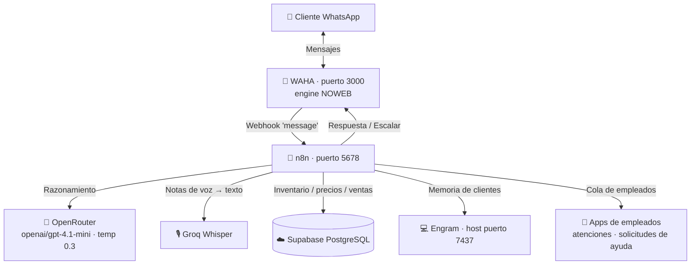

# 🪚 Perucho — Agente de IA para WhatsApp · Ferretería El Serrucho

[](https://nodejs.org/)
[](https://www.docker.com/)
[](LICENSE)
[](https://n8n.io/)

Orquestación **local** que automatiza la atención al cliente por WhatsApp de la **Ferretería El Serrucho** (Mene Mauroa, Estado Falcón): consulta de inventario y precios en tiempo real, cotizaciones exactas, transcripción de notas de voz, memoria de clientes y escalación a empleados cuando hace falta una persona.

El asistente se llama **"Perucho"** 👨🏻‍🔧 y corre sobre infraestructura local (Docker) + una base de datos en la nube (Supabase), sin costos recurrentes de servidor.

---

## 🏗️ Arquitectura

Arquitectura local dirigida por eventos. WhatsApp entra por **WAHA**, n8n orquesta el razonamiento con un LLM vía **OpenRouter**, consulta **Supabase** y recuerda clientes con **Engram**.



### 🧰 Stack tecnológico

| Componente | Tecnología |
| :--- | :--- |
| WhatsApp HTTP API | [WAHA](https://waha.devlike.pro/) (Docker, engine NOWEB) |
| Orquestación de flujos | [n8n](https://n8n.io/) (Docker) |
| Inferencia LLM | [OpenRouter](https://openrouter.ai/) → `openai/gpt-4.1-mini` (temp 0.3) |
| Transcripción de voz | [Groq](https://groq.com/) Whisper |
| Base de datos | [Supabase](https://supabase.com/) (PostgreSQL + `pg_trgm`) |
| Memoria a largo plazo | [Engram](https://github.com/EngineVault/engram) |
| Runtime | Node.js 18+ |

### Flujo del mensaje (workflow n8n, 30 nodos)

1. **Webhook** recibe el evento de WAHA → filtra que sea un cliente real (no grupos/propios) y anti-duplicados.
2. **Notas de voz** se transcriben con Groq Whisper antes de procesarse.
3. **Filtro de texto** + **rate limit** (máx. 10 mensajes / 60 s por teléfono) + **handover manual** (si un empleado tomó el chat, el bot calla).
4. **Cliente Memoria** carga nombre/notas del cliente desde Supabase/Engram.
5. **AI Agent** razona con sus herramientas y produce la respuesta.
6. **Sanitize Agent Output** descarta salidas corruptas del LLM (tool-calls filtradas / bucles de repetición) antes de enviarlas.
7. Según marcadores de la respuesta: `[ESCALAR_HUMANO]` → cola de atención; `[PEDIR_AYUDA]` → solicitud de ayuda; si no, se envía la respuesta al cliente.

### Herramientas del agente (toolCode en n8n)

| Tool | Función |
| :--- | :--- |
| `buscar_productos` | Búsqueda de inventario con relevancia + medidas robustas (NxM, fracciones, calibre, largo) y reglas de negocio (cabilla, cemento). Devuelve precio en USD y en Bs. |
| `hacer_presupuesto` | Cotiza una lista de productos con cantidades; ofrece alternativas disponibles cuando el exacto está agotado. |
| `obtener_tasa_bcv` | Tasa de cambio actual (tabla `tazas`). |
| `buscar_memoria_engram` / `guardar_memoria_engram` | Memoria a largo plazo del cliente (Engram). |

---

## 🧩 Fuente única de la búsqueda (importante para desarrollar)

La lógica del matcher **vive una sola vez** en [`lib/serrucho-search.js`](lib/serrucho-search.js) (`norm`, `normMedida`, `medPresent`, `scoreMatch`, `expandir`, `singular`, `parseItems`, …). Esa misma fuente está **embebida** en los nodos de n8n. La cadena de verdad es:

```
lib/serrucho-search.js  (canónico)
        │  (mismas funciones, verbatim)
        ▼
scratch_live/live_buscar.js · live_presupuesto.js · live_systemMessage.txt   (dumps del workflow vivo)
        │  copia exacta                         │  build_workflow.js
        ▼                                       ▼
scripts/new_buscar.js · new_presupuesto.js   n8n_workflow.json   →   nodos del workflow en n8n
```

`npm test` ejecuta los **guards de sincronía** y los unit tests:

```bash
npm test    # node --test  +  check_sources_sync.js  +  check_workflow_sync.js
```

- `check_sources_sync.js` — falla si `lib` se desincroniza de los dumps o si `new_*.js ≠ dumps`.
- `check_workflow_sync.js` — falla si el código embebido en `n8n_workflow.json` se desvía de los dumps.

> ⚠️ **Regla de oro:** `buscar_productos` y `hacer_presupuesto` tienen cada uno su **propia copia** de las funciones del matcher. Si cambias la lógica, cámbiala en **ambos** dumps (y en `lib`), y corre `npm test`. El loop de despliegue al n8n vivo está en `scripts/patch_*.js` (fetch → modificar → PUT a la API local de n8n) seguido de re-dump con `scripts/_inspect_live.js`.

---

## 🚀 Requisitos

| Requisito | Mínimo | Recomendado |
| :--- | :--- | :--- |
| SO | Windows 10/11 | Windows 11 |
| CPU | 4 núcleos | 8 núcleos |
| RAM | 8 GB | 16 GB |
| Almacenamiento | 50 GB SSD | 100 GB SSD |

Requiere **Docker Desktop**, **Node.js 18+** e internet (OpenRouter, Groq, Supabase).

> **Nota:** Linux/macOS sirven para desarrollo, pero los scripts `.ps1`/`.vbs` de arranque son exclusivos de Windows.

---

## 🛠️ Instalación

```bash
git clone https://github.com/Gus2708/whatsapp-agent.git
cd whatsapp-agent
npm run setup        # o: node setup.js
```

El instalador (`setup.js`) verifica Node/Git/Docker (instala con `winget` en Windows si faltan), descarga el servidor de memorias **Engram** en `%USERPROFILE%\.engram\bin` y lo añade al `PATH`, y crea tu archivo `.env` a partir de [`.env.example`](.env.example).

### Variables de entorno (`.env`)

| Variable | Para qué |
| :--- | :--- |
| `WAHA_DASHBOARD_USERNAME` / `WAHA_DASHBOARD_PASSWORD` | Login del panel de WAHA. |
| `WAHA_API_KEY` | Clave que usan n8n ↔ WAHA para enviar mensajes. |
| `SUPABASE_URL` / `SUPABASE_ANON_KEY` | Base de datos en la nube. |
| `OPENROUTER_API_KEY` | Inferencia del modelo (`openai/gpt-4.1-mini`). |
| `GROQ_API_KEY` | Transcripción de notas de voz (Whisper). |
| `ENGRAM_HOST` | Servidor de memorias (por defecto `host.docker.internal:7437`). |
| `N8N_API_KEY` | Solo para los scripts de desarrollo/despliegue (`scripts/patch_*.js`). |

> ⚠️ **Nunca subas el archivo `.env` al repositorio.** Ya está en `.gitignore`.

---

## ⚙️ Configuración

1. **Supabase** — en el SQL Editor ejecuta [`supabase_schema.sql`](supabase_schema.sql). Crea las **12 tablas** (productos, clientes, tazas, chat_sessions, ventas, ventas_detalle, ordenes_cambio[_items], atenciones_pendientes, solicitudes_ayuda[_items], push_subscriptions), índices GIN/trigram (`pg_trgm`) y funciones RPC de búsqueda/popularidad. RLS habilitado.
2. **WAHA** — abre `http://localhost:3000`, entra con las credenciales del `.env`, ve a **Sessions**, inicia la sesión `default` y escanea el QR con el WhatsApp de la tienda. (Engine **NOWEB**; la sesión se persiste en un volumen y se reanuda sola al reiniciar.)
3. **n8n** — abre `http://localhost:5678`, **Import from file** → [`n8n_workflow.json`](n8n_workflow.json). Configura credenciales de **OpenRouter** y activa el flujo (**Active**).

---

## 🏃 Arranque

```bash
npm start            # = start_agent.ps1  (Engram + siembra de memorias + contenedores + healthcheck)
```

En la PC de la tienda el arranque y la resiliencia están automatizados con scripts PowerShell (lanzados de forma invisible vía `.vbs`):

* **`boot_serrucho.ps1`** — al encender: levanta Docker Desktop, los contenedores n8n + WAHA y Engram.
* **`catchup_serrucho.ps1`** — tras un apagón: reinyecta a n8n los últimos mensajes de clientes (< 24 h) sin responder, con `catchup:true`.
* **`waha_watchdog.ps1`** — mantiene viva la sesión de WhatsApp (vía Task Scheduler).

---

## 👷 Apps de empleados (cola en Supabase)

Cuando el bot no basta, encola al cliente y un empleado lo atiende desde una app que lee Supabase por Realtime:

* **Atenciones pendientes** — el cliente pide hablar con una persona (`[ESCALAR_HUMANO]`) → tabla `atenciones_pendientes`. Ver [`GUIA-APP-ATENCIONES.md`](GUIA-APP-ATENCIONES.md).
* **Solicitudes de ayuda** — el bot no encuentra un producto o el cliente refuta el resultado (`[PEDIR_AYUDA]`) → tabla `solicitudes_ayuda`; el empleado elige los productos y el webhook `/reenviar-ayuda` se los reenvía al cliente. Ver [`GUIA-APP-SOLICITUDES-AYUDA.md`](GUIA-APP-SOLICITUDES-AYUDA.md).

---

## 🔒 Reglas de negocio de Perucho

* **Precios reales de la BD** — USD (*Precio Divisas*) y bolívares con el recargo de tienda aplicado y la tasa BCV; nunca revela el porcentaje de recargo ni inventa impuestos.
* **Datos de pago** — el bot **nunca** comparte números de pago/cuentas; para pagar deriva a un empleado o a la tienda física.
* **Retiro en tienda** (Mene Mauroa) + transporte local de materiales según el caso.
* **Notas de voz** — se transcriben automáticamente (Groq Whisper); imágenes/stickers reciben respuesta amable pidiendo texto.
* **Rate limiting** — 10 mensajes / minuto por teléfono.
* **Handover manual** — si un empleado toma el chat (`chat_sessions.estado = 'manual'`), el bot deja de responder.
* **Memoria Engram** — reconoce clientes por teléfono y recuerda nombre/notas.
* **Anti-basura** — el nodo *Sanitize Agent Output* evita que una salida corrupta del LLM llegue al cliente.

---

## 📁 Estructura del proyecto

| Ruta | Contenido |
| :--- | :--- |
| `lib/serrucho-search.js` | **Fuente única** del matcher de búsqueda/cotización. |
| `scratch_live/` | Dumps canónicos del workflow vivo (`live_buscar.js`, `live_presupuesto.js`, `live_systemMessage.txt`). |
| `n8n_workflow.json` | Snapshot completo del flujo de n8n (importable / recuperación). |
| `scripts/` | Despliegue (`patch_*.js`), inspección (`_inspect_live.js`), build/guards (`build_workflow.js`, `check_*_sync.js`) y harnesses de prueba (`_test_*.js`). |
| `tests/` | Unit tests de `lib` (`node --test`). |
| `supabase_schema.sql` | DDL completo (12 tablas, índices, RPC, RLS). |
| `docker-compose.yml` · `Dockerfile` | n8n (con docker-cli) + WAHA. |
| `setup.js` · `start_agent.ps1` · `seed_memory.js` | Instalación, arranque y siembra de memorias base. |
| `boot_serrucho.*` · `catchup_serrucho.*` · `waha_watchdog.*` | Arranque automático, recuperación de mensajes y watchdog de sesión. |
| `data/serrucho_context.json` | Contexto del comercio. |
| `plans/` | Notas de planificación de cambios técnicos. |
| `GUIA-APP-*.md` | Guías de las apps de empleados. |
| `.agents/` | Skills y reglas del agente de desarrollo. |

---

## 🧪 Desarrollo y pruebas

```bash
npm test                                   # guards de sincronía + unit tests de lib
node scripts/_test_busqueda_50.js          # 50 búsquedas reales vs Supabase real
node scripts/_test_conversacional_50.js    # 50 flujos conversacionales (buscar + presupuesto)
node scripts/_inspect_live.js              # re-dumpear el workflow vivo a scratch_live/
```

> Los harnesses `_test_*.js` ejecutan el **cuerpo real** de las tools contra la base de datos de producción (solo lectura), para cazar fallas del algoritmo con mensajes fieles a los chats reales.

---

## 📄 Licencia

MIT.
