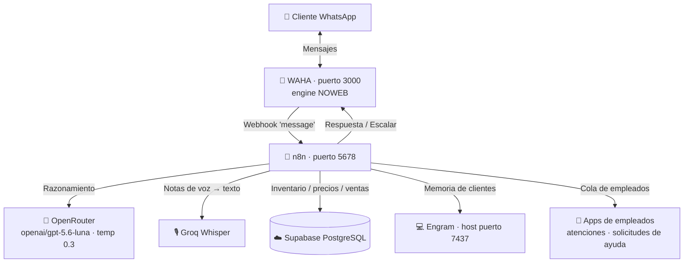

# 🪚 Perucho — Agente de IA para WhatsApp · Ferretería El Serrucho

[](https://nodejs.org/)
[](https://www.docker.com/)
[](https://platform.openai.com/)
[](LICENSE)
[](https://n8n.io/)

Agente de IA en producción que automatiza la atención al cliente por WhatsApp de la **Ferretería El Serrucho** (Mene Mauroa, Estado Falcón): búsqueda de inventario y precios en tiempo real sobre un catálogo de 7.650 SKUs, cotizaciones exactas, transcripción de notas de voz, memoria de clientes y escalación a empleados cuando hace falta una persona. Integra modelos de **OpenAI** (razonamiento vía OpenRouter + embeddings `text-embedding-3-small`) en un pipeline de recuperación de 5 capas medido contra 320 consultas reales.

El asistente se llama **"Perucho"** 👨🏻‍🔧 y corre sobre infraestructura local (Docker) + una base de datos en la nube (Supabase), sin costos recurrentes de servidor.

### 🎥 Demo

https://github.com/user-attachments/assets/fe28172d-64c1-45f9-9b08-edaab0f9a69c

> Perucho respondiendo por WhatsApp en producción.

---

## 🏗️ Arquitectura

Arquitectura local dirigida por eventos. WhatsApp entra por **WAHA**, n8n orquesta el razonamiento con un LLM vía **OpenRouter**, consulta **Supabase** y recuerda clientes con **Engram**.


```mermaid
graph TD
    Client[📱 Cliente WhatsApp] <-->|Mensajes| WAHA[🐋 WAHA · puerto 3000<br/>engine NOWEB]
    WAHA -->|Webhook 'message'| N8N[🐋 n8n · puerto 5678]
    N8N -->|Razonamiento| Model[🧠 OpenRouter<br/>openai/gpt-5.6-luna · temp 0.3]
    N8N -->|Notas de voz → texto| Groq[🎙️ Groq Whisper]
    N8N -->|Inventario / precios / ventas| Supabase[(☁️ Supabase PostgreSQL)]
    N8N -->|Memoria de clientes| Engram[💻 Engram · host puerto 7437]
    N8N -->|Respuesta / Escalar| WAHA
    N8N -->|Cola de empleados| Apps[👷 Apps de empleados<br/>atenciones · solicitudes de ayuda]
```

### 🧰 Stack tecnológico

| Componente | Tecnología |
| :--- | :--- |
| WhatsApp HTTP API | [WAHA](https://waha.devlike.pro/) (Docker, engine NOWEB) |
| Orquestación de flujos | [n8n](https://n8n.io/) (Docker) |
| Inferencia LLM | [OpenRouter](https://openrouter.ai/) → `openai/gpt-5.6-luna` (temp 0.3) |
| Transcripción de voz | [Groq](https://groq.com/) Whisper |
| Base de datos | [Supabase](https://supabase.com/) (PostgreSQL + `pg_trgm` + `pgvector`) |
| Embeddings | OpenAI `text-embedding-3-small` (opcional — ver nota abajo) |
| Memoria a largo plazo | [Engram](https://github.com/EngineVault/engram) |
| Runtime | Node.js 18+ |

### Cómo encuentra un producto (cascada de 5 capas)

El cliente escribe como habla, no como está escrito el catálogo. La búsqueda baja por capas
y **solo pasa a la siguiente si la anterior no encontró nada**, así que el caso normal
(«cemento gris») se resuelve en la primera, en ~900 ms y sin gastar un centavo.

| # | Capa | Qué resuelve |
| :-- | :--- | :--- |
| 1 | **Léxico** (`ilike` + `SIN` + medidas) | El grueso. Sinónimos a mano (con límite de palabra), medidas NxM/fracciones/calibre, stopwords conversacionales. |
| 2 | **Diccionario de catálogo** (`catalogo_vocabulario`, 3.5k términos) | Coloquialismos generados leyendo el catálogo: *chapa*→cerradura, *foco*→bombillo, *cincho*→abrazadera. |
| 3 | **Relajación + fuzzy `pg_trgm`** | Erratas fuertes y consultas que fallan por una palabra. |
| 4 | **Búsqueda vectorial** (`pgvector`, umbral 0.45) | Variantes de nombre: *tapa para el baño* → TAPA DE INODORO. **+7 aciertos medidos** sobre 320. |
| 5 | **Rescate semántico** (Luna + las 710 categorías) | El cliente describe la FUNCIÓN: *«lo que se usa para pegar los bloques»* → cemento. Lo que acierta se guarda en el diccionario: la próxima vez es gratis. |
| ★ | **Ventas recientes** (`producto_popularidad`) | Señal transversal que reordena: lo que de verdad se vende sube, el stock fantasma cae. |

Las capas 4 y 5 devuelven una **hipótesis**, no un hallazgo: el bot está obligado a preguntar
«¿te refieres a…?» y a emitir `[PEDIR_AYUDA]` si el cliente lo refuta.

**Estado medido** (320 consultas coloquiales): **76,9 % de recall exacto, 6,3 % de fallos.**
Con la capa vectorial 246 aciertos frente a 239 sin ella, o sea **+7 atribuibles al vector**.

> **Sobre los embeddings — el texto de entrada se rediseñó hasta que el vector aportó señal real.**
> Embebiendo `descripción + categoría + coloquialismos` (en vez de la descripción cruda) el margen
> señal/ruido pasó de **0.012 a 0.123**, lo que se tradujo en los **+7 aciertos medidos** de la
> capa 4. La descripción cruda no llegó a ese punto: son cadenas de SKU cortas, no prosa, así que
> el vector terminaba midiendo el mismo solapamiento léxico que `pg_trgm` ya cubría (72,2 % con y
> sin embeddings, idéntico caso por caso) — un hallazgo de la fase de evaluación, no una limitación
> del enfoque. La capa sigue siendo opcional por diseño: **si `OPENAI_API_KEY` está vacía, la
> búsqueda funciona igual**, solo sin la capa 4.
>
> **Ojo con el stock fantasma:** de 5.046 productos con existencia, **2.559 (51 %) no venden
> hace un año**. Por eso el ranking por ventas usa nº de FACTURAS, no unidades: 80 facturas
> son 80 decisiones de compra, las unidades las distorsiona un mayorista.

Para el detalle completo —estadísticas, decisiones, lo que se probó y **no** funcionó, y
dónde investigar mejoras— ver **[RAG.md](RAG.md)**.

### Flujo del mensaje (workflow n8n, 30 nodos)

1. **Webhook** recibe el evento de WAHA → filtra que sea un cliente real (no grupos/propios) y anti-duplicados.
2. **Notas de voz** se transcriben con Groq Whisper antes de procesarse.
3. **Filtro de texto** + **rate limit** (máx. 10 mensajes / 60 s por teléfono) + **handover manual** (si un empleado tomó el chat, el bot calla).
4. **Cliente Memoria** carga nombre/notas del cliente desde Supabase/Engram.
5. **AI Agent** razona con sus herramientas y produce la respuesta.
6. **Sanitize Agent Output** descarta salidas corruptas del LLM (tool-calls filtradas / bucles de repetición) antes de enviarlas.
7. Según marcadores de la respuesta: `[ESCALAR_HUMANO]` → cola de atención; `[PEDIR_AYUDA]` → solicitud de ayuda; si no, se envía la respuesta al cliente.

### Herramientas del agente (toolCode en n8n)

| Tool | Función |
| :--- | :--- |
| `buscar_productos` | Búsqueda de inventario con relevancia + medidas robustas (NxM, fracciones, calibre, largo) y reglas de negocio (cabilla, cemento). Devuelve precio en USD y en Bs. |
| `hacer_presupuesto` | Cotiza una lista de productos con cantidades; ofrece alternativas disponibles cuando el exacto está agotado. |
| `obtener_tasa_bcv` | Tasa de cambio actual (tabla `tazas`). |
| `buscar_memoria_engram` / `guardar_memoria_engram` | Memoria a largo plazo del cliente (Engram). |

---

## 🧩 Fuente única de la búsqueda (importante para desarrollar)

La lógica del matcher **vive una sola vez** en [`lib/serrucho-search.js`](lib/serrucho-search.js) (`norm`, `normMedida`, `medPresent`, `scoreMatch`, `expandir`, `singular`, `parseItems`, …). Esa misma fuente está **embebida** en los nodos de n8n. La cadena de verdad es:

```
lib/serrucho-search.js  (canónico)
        │  (mismas funciones, verbatim)
        ▼
scratch_live/live_buscar.js · live_presupuesto.js · live_systemMessage.txt   (dumps del workflow vivo)
        │  copia exacta                         │  build_workflow.js
        ▼                                       ▼
scripts/new_buscar.js · new_presupuesto.js   n8n_workflow.json   →   nodos del workflow en n8n
```

`npm test` ejecuta los **guards de sincronía** y los unit tests:

```bash
npm test    # node --test  +  check_sources_sync.js  +  check_workflow_sync.js
```

- `check_sources_sync.js` — falla si `lib` se desincroniza de los dumps o si `new_*.js ≠ dumps`.
- `check_workflow_sync.js` — falla si el código embebido en `n8n_workflow.json` se desvía de los dumps.

> ⚠️ **Regla de oro:** `buscar_productos` y `hacer_presupuesto` tienen cada uno su **propia copia** de las funciones del matcher. Si cambias la lógica, cámbiala en **ambos** dumps (y en `lib`), y corre `npm test`. El loop de despliegue al n8n vivo está en `scripts/patch_*.js` (fetch → modificar → PUT a la API local de n8n) seguido de re-dump con `scripts/_inspect_live.js`.

---

## 🚀 Requisitos

| Requisito | Mínimo | Recomendado |
| :--- | :--- | :--- |
| SO | Windows 10/11 | Windows 11 |
| CPU | 4 núcleos | 8 núcleos |
| RAM | 8 GB | 16 GB |
| Almacenamiento | 50 GB SSD | 100 GB SSD |

Requiere **Docker Desktop**, **Node.js 18+** e internet (OpenRouter, Groq, Supabase).

> **Nota:** Linux/macOS sirven para desarrollo, pero los scripts `.ps1`/`.vbs` de arranque son exclusivos de Windows.

---

## 🛠️ Instalación

```bash
git clone https://github.com/Gus2708/whatsapp-agent.git
cd whatsapp-agent
npm run setup        # o: node setup.js
```

El instalador (`setup.js`) verifica Node/Git/Docker (instala con `winget` en Windows si faltan), descarga el servidor de memorias **Engram** en `%USERPROFILE%\.engram\bin` y lo añade al `PATH`, y crea tu archivo `.env` a partir de [`.env.example`](.env.example).

### Variables de entorno (`.env`)

| Variable | Para qué |
| :--- | :--- |
| `WAHA_DASHBOARD_USERNAME` / `WAHA_DASHBOARD_PASSWORD` | Login del panel de WAHA. |
| `WAHA_API_KEY` | Clave que usan n8n ↔ WAHA para enviar mensajes. |
| `SUPABASE_URL` / `SUPABASE_ANON_KEY` | Base de datos en la nube. |
| `OPENROUTER_API_KEY` | Inferencia del modelo (`openai/gpt-5.6-luna`). |
| `GROQ_API_KEY` | Transcripción de notas de voz (Whisper). |
| `ENGRAM_HOST` | Servidor de memorias (por defecto `host.docker.internal:7437`). |
| `N8N_API_KEY` | Solo para los scripts de desarrollo/despliegue (`scripts/patch_*.js`). |

> ⚠️ **Nunca subas el archivo `.env` al repositorio.** Ya está en `.gitignore`.

---

## ⚙️ Configuración

1. **Supabase** — en el SQL Editor ejecuta [`supabase_schema.sql`](supabase_schema.sql). Crea las **12 tablas** (productos, clientes, tazas, chat_sessions, ventas, ventas_detalle, ordenes_cambio[_items], atenciones_pendientes, solicitudes_ayuda[_items], push_subscriptions), índices GIN/trigram (`pg_trgm`) y funciones RPC de búsqueda/popularidad. RLS habilitado.
2. **WAHA** — abre `http://localhost:3000`, entra con las credenciales del `.env`, ve a **Sessions**, inicia la sesión `default` y escanea el QR con el WhatsApp de la tienda. (Engine **NOWEB**; la sesión se persiste en un volumen y se reanuda sola al reiniciar.)
3. **n8n** — abre `http://localhost:5678`, **Import from file** → [`n8n_workflow.json`](n8n_workflow.json). Configura credenciales de **OpenRouter** y activa el flujo (**Active**).

---

## 🏃 Arranque

```bash
npm start            # = start_agent.ps1  (Engram + siembra de memorias + contenedores + healthcheck)
```

En la PC de la tienda el arranque y la resiliencia están automatizados con scripts PowerShell (lanzados de forma invisible vía `.vbs`):

* **`boot_serrucho.ps1`** — al encender: levanta Docker Desktop, los contenedores n8n + WAHA y Engram.
* **`catchup_serrucho.ps1`** — tras un apagón: reinyecta a n8n los últimos mensajes de clientes (< 24 h) sin responder, con `catchup:true`.
* **`waha_watchdog.ps1`** — mantiene viva la sesión de WhatsApp (vía Task Scheduler).

---

## 👷 Apps de empleados (cola en Supabase)

Cuando el bot no basta, encola al cliente y un empleado lo atiende desde una app que lee Supabase por Realtime:

* **Atenciones pendientes** — el cliente pide hablar con una persona (`[ESCALAR_HUMANO]`) → tabla `atenciones_pendientes`. Ver [`GUIA-APP-ATENCIONES.md`](GUIA-APP-ATENCIONES.md).
* **Solicitudes de ayuda** — el bot no encuentra un producto o el cliente refuta el resultado (`[PEDIR_AYUDA]`) → tabla `solicitudes_ayuda`; el empleado elige los productos y el webhook `/reenviar-ayuda` se los reenvía al cliente. Ver [`GUIA-APP-SOLICITUDES-AYUDA.md`](GUIA-APP-SOLICITUDES-AYUDA.md).

---

## 🔒 Reglas de negocio de Perucho

* **Precios reales de la BD** — USD (*Precio Divisas*) y bolívares con el recargo de tienda aplicado y la tasa BCV; nunca revela el porcentaje de recargo ni inventa impuestos.
* **Datos de pago** — el bot **nunca** comparte números de pago/cuentas; para pagar deriva a un empleado o a la tienda física.
* **Retiro en tienda** (Mene Mauroa) + **transporte de materiales a $10** dentro del casco central; fuera del casco central el costo lo coordina un empleado.
* **Notas de voz** — se transcriben automáticamente (Groq Whisper); imágenes/stickers reciben respuesta amable pidiendo texto.
* **Rate limiting** — 10 mensajes / minuto por teléfono.
* **Handover manual** — si un empleado toma el chat (`chat_sessions.estado = 'manual'`), el bot deja de responder.
* **Memoria Engram** — reconoce clientes por teléfono y recuerda nombre/notas.
* **Anti-basura** — el nodo *Sanitize Agent Output* evita que una salida corrupta del LLM llegue al cliente.

---

## 📁 Estructura del proyecto

| Ruta | Contenido |
| :--- | :--- |
| `lib/serrucho-search.js` | **Fuente única** del matcher de búsqueda/cotización. |
| `scratch_live/` | Dumps canónicos del workflow vivo (`live_buscar.js`, `live_presupuesto.js`, `live_systemMessage.txt`). |
| `n8n_workflow.json` | Snapshot completo del flujo de n8n (importable / recuperación). |
| `scripts/` | Despliegue (`patch_*.js`), inspección (`_inspect_live.js`), build/guards (`build_workflow.js`, `check_*_sync.js`) y harnesses de prueba (`_test_*.js`). |
| `tests/` | Unit tests de `lib` (`node --test`). |
| `supabase_schema.sql` | DDL completo (índices, RPC, RLS). Ojo: las tablas de vocabulario, embeddings, descripciones y popularidad se crearon por migración y **no están aquí**. |
| [`RAG.md`](RAG.md) | Cómo funciona la búsqueda, estadísticas medidas y dónde investigar mejoras. |
| `plans/` | Notas de cambios técnicos. [`006`](plans/006-fusion-hibrida-rrf.md) documenta la fusión RRF pendiente y los intentos fallidos. |
| `scratch_live/_coloquial_set*.json` | Sets de prueba cacheados (320 y 80 casos) para que el antes/después sea comparable. |
| `docker-compose.yml` · `Dockerfile` | n8n (con docker-cli) + WAHA. |
| `setup.js` · `start_agent.ps1` · `seed_memory.js` | Instalación, arranque y siembra de memorias base. |
| `boot_serrucho.*` · `catchup_serrucho.*` · `waha_watchdog.*` | Arranque automático, recuperación de mensajes y watchdog de sesión. |
| `data/serrucho_context.json` | Contexto del comercio. |
| `plans/` | Notas de planificación de cambios técnicos. |
| `GUIA-APP-*.md` | Guías de las apps de empleados. |
| `.agents/` | Skills y reglas del agente de desarrollo. |

---

## 🧪 `rag` — CLI de la capa de búsqueda

Punto de entrada único para diagnosticar, medir y mantener la búsqueda.

```bash
node rag.js                       # estado del sistema
node rag.js ayuda                 # todos los comandos
```

```
╭──────────────────────────────────────────────────────────────╮
│ RAG · Perucho                         Ferretería El Serrucho │
╰──────────────────────────────────────────────────────────────╯

 CATÁLOGO Y VECTORES
 ──────────────────────────────────────────────────────────────
  productos en catálogo                                7.688
  con vector                                           7.688
  cobertura vectorial                                 100.0%
  ██████████████████████████████████████████████████████████
  sin vector                                               0 ✓
```

| Grupo | Comandos |
| :--- | :--- |
| **Diagnóstico** | `estado` · `buscar "<consulta>"` · `diag "<consulta>"` |
| **Métricas** | `suite [--rapida]` · `medir [--sin-vector]` · `regresion` · `vector` · `fallos` · `auditar` |
| **Mantenimiento** | `embeddings` · `vocabulario` · `descripciones` · `popularidad` · `desplegar` |

- **`estado`** cruza catálogo, vectores, diccionario y ventas; detecta las tres formas de
  desalineación (sin vector, descripción movida, vocabulario más nuevo que los embeddings),
  da el comando exacto para cada una y **sale con código 1** si algo requiere acción.
- **`buscar`** ejecuta el cuerpo **real** del nodo contra Supabase y muestra qué devolvería
  el bot, con las marcas de hipótesis/parcial y la instrucción que recibe el modelo.
- **`diag`** explica por qué la capa vectorial actuó o no en una consulta concreta:
  si el gatillo disparó, latencia del embedding, similitudes crudas y qué decidió la adopción.
- **`suite`** corre todos los harness de una y resume: 443 casos con el recall completo,
  123 en `--rapida` (salta el recall de 320, que tarda ~15 min).

El CLI **orquesta** los scripts de `scripts/`, no duplica su lógica. Cada uno sigue siendo
ejecutable por separado.

> Los harness ejecutan el **cuerpo real** de las tools contra la base de producción (solo
> lectura), para cazar fallas del algoritmo con mensajes fieles a los chats reales.
>
> El recall cachea sus consultas en `scratch_live/_coloquial_set.json` **a propósito**:
> comparar dos corridas con preguntas distintas no mide nada. Regenerar con `--generar N`
> solo cuando quieras un set nuevo, y entonces re-medir la línea base.

### Ciclo de despliegue

```bash
node rag.js desplegar                      # dumps scratch_live/ -> nodos del n8n vivo
node scripts/export_workflow.js            # n8n vivo -> n8n_workflow.json (snapshot fiel)
node scripts/build_workflow.js             # normaliza el JSON desde los dumps
```

> `desplegar` corre **`npm test` antes del PUT** y aborta si falla: desplegar a n8n es
> publicar en producción, el bot atiende clientes reales en cuanto el PUT devuelve 200.
> `--sin-test` lo salta, pero hay que escribirlo a propósito.

### Mantenimiento nocturno — y lo que NO es automático

El workflow n8n **«Sync Vocabulario Catálogo»** (cron 3:00 AM):

```
Cada noche 3:00 → Sincronizar Vocabulario → Monitor Embeddings → Refrescar Popularidad
```

Vocabulario y ranking por ventas **sí se mantienen solos**, incrementales por hash. Va en un
workflow **aparte** del flujo de mensajes para no sumar latencia a ningún cliente.

> **Los embeddings NO se generan solos.** El tercer nodo es un **monitor**: detecta y avisa,
> no embebe. No puede hacerlo por dos límites reales — escribir vectores con el índice HNSW
> presente revienta el `statement_timeout` (error `57014`) y la anon key no puede quitar el
> índice, y además no puede recalcular el hash del texto enriquecido. Un job que no puede
> hacer su trabajo debe decirlo, no fingirlo: **antes reportaba `ok:true` escribiendo cero y
> estuvo 20 días así sin que nadie lo notara.**
>
> Cuando `node rag.js estado` avise, el ciclo manual es:
> ```
> drop index if exists idx_productos_embedding_hnsw;
> node rag.js embeddings
> create index idx_productos_embedding_hnsw on productos_embedding
>   using hnsw (embedding extensions.vector_cosine_ops);
> ```
> El script avisa si hay más de 500 filas pendientes. **Hazle caso.**

---

## 📄 Licencia

MIT.
