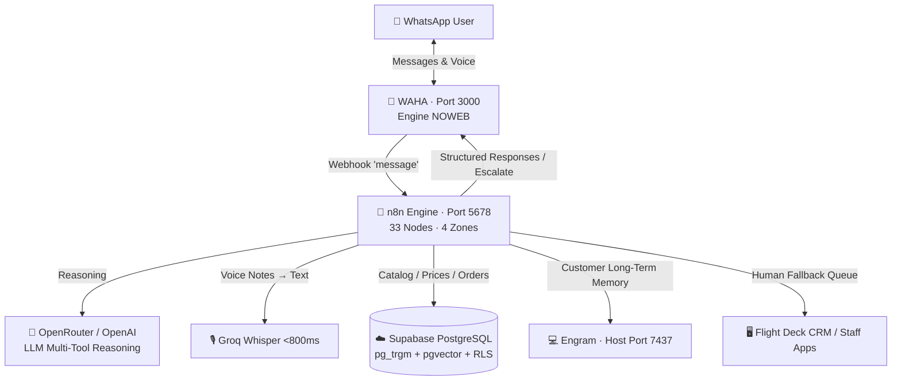
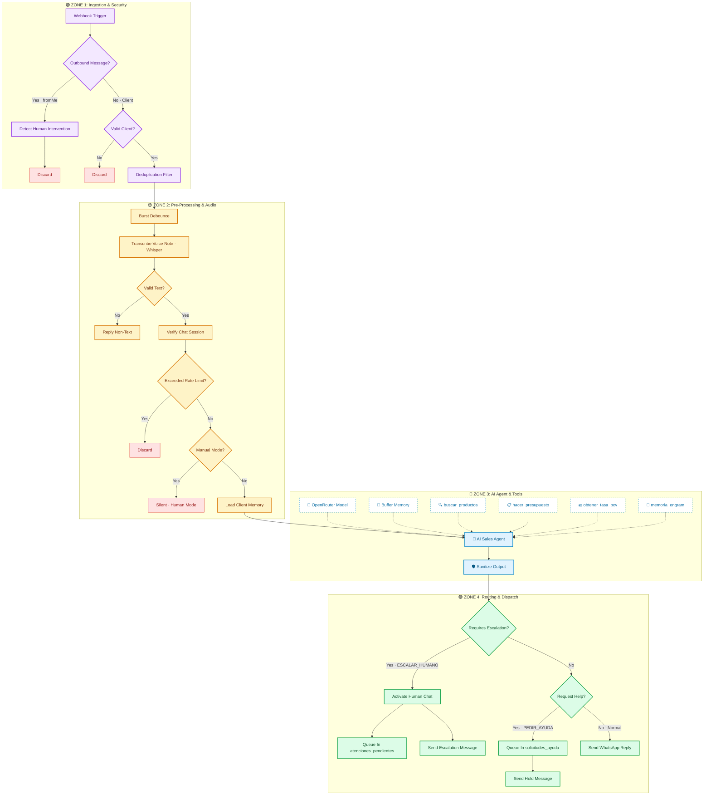

# 🤖 WhatsApp AI Sales Agent — Production-Ready Open-Source Engine

[](https://nodejs.org/)
[](https://www.docker.com/)
[](LICENSE)
[](https://n8n.io/)
[](https://supabase.com/)

A modular, white-label, production-grade **WhatsApp AI Sales & Customer Support Agent**. Automates real-time inventory search, price quotations, voice note transcription, persistent customer memory, and seamless human escalation.

Engineered with local-first orchestration (Docker + n8n + WAHA) and a 5-layer hybrid retrieval pipeline (Lexical + Catalog Synonyms + Fuzzy Trigrams + pgvector + Semantic Recovery LLM). Fully customizable for any commercial store or retail business via environment variables (`.env`).

---

## 🏗️ Architecture

Event-driven architecture with zero recurring VPS fees. WhatsApp messages arrive via **WAHA**, n8n orchestrates conversational reasoning with LLMs via **OpenRouter**, queries PostgreSQL in **Supabase**, and stores customer memory with **Engram**.


```mermaid
graph TD
    Client[📱 WhatsApp User] <-->|Messages & Voice| WAHA[🐋 WAHA · Port 3000<br/>Engine NOWEB]
    WAHA -->|Webhook 'message'| N8N[🐋 n8n Engine · Port 5678<br/>33 Nodes · 4 Zones]
    N8N -->|Reasoning| Model[🧠 OpenRouter / OpenAI<br/>LLM Multi-Tool Reasoning]
    N8N -->|Voice Notes → Text| Groq[🎙️ Groq Whisper <800ms]
    N8N -->|Catalog / Prices / Orders| Supabase[(☁️ Supabase PostgreSQL<br/>pg_trgm + pgvector + RLS)]
    N8N -->|Customer Long-Term Memory| Engram[💻 Engram · Host Port 7437]
    N8N -->|Structured Responses / Escalate| WAHA
    N8N -->|Human Fallback Queue| FlightDeck[🖥️ Flight Deck CRM / Staff Apps]
```

### 🧰 Technology Stack

| Component | Technology | Purpose |
| :--- | :--- | :--- |
| **WhatsApp HTTP API** | [WAHA](https://waha.devlike.pro/) (Docker, engine NOWEB) | Multi-device session emulation and webhook delivery. |
| **Workflow Orchestrator** | [n8n](https://n8n.io/) (Docker) | Event management, state routing, rate limiting, and tool dispatch. |
| **LLM Reasoning** | [OpenRouter](https://openrouter.ai/) / OpenAI | Multi-turn reasoning and tool invocation under strict constraints. |
| **Voice Transcription** | [Groq](https://groq.com/) Whisper | Audio note transcription in <800ms. |
| **Database & Search** | [Supabase](https://supabase.com/) (PostgreSQL + `pg_trgm` + `pgvector`) | Inventory catalog, order queue, and hybrid vector search. |
| **Long-Term Memory** | [Engram](https://github.com/EngineVault/engram) | Persistent cross-session customer facts and preferences. |
| **Flight Deck & CRM** | [Next.js](https://nextjs.org/) (App Router + Tailwind + GSAP + PWA) | Live telemetry, chat operations queue, and RAG studio. |
| **Runtime** | Node.js 18+ | CLI tools, sync guards, and recovery engine. |

---

## 🔍 The 5-Layer Hybrid Search Pipeline (RAG)

Customers write conversationally (*"the glue for PVC pipes"*, *"gray cement 1/2"*), not with catalog SKUs. The search engine executes a multi-layer cascade that **only falls through to the next layer if the previous layer yielded no confident match**:

| # | Layer | Implementation | What It Resolves |
| :- | :--- | :--- | :--- |
| **1** | **Lexical AST** | `ilike` + dimension parser (`NxM`, fractions, caliber) | Core queries in ~50ms without API cost (resolves ~70% of volume). |
| **2** | **Catalog Dictionary** | Inverted synonym table (`catalogo_vocabulario`) | Regional jargon and colloquialisms (*chapa* → lock, *foco* → lightbulb). |
| **3** | **Fuzzy Trigram** | `pg_trgm` GIN similarity indexes | Severe typos, transposed letters, or single missing terms. |
| **4** | **Vector Search** | `pgvector` cosine similarity (`text-embedding-3-small`) | Phrasing variations (*"toilet seat cover"* → `TOILET SEAT STANDARD`). |
| **5** | **Semantic Recovery** | LLM category classification & intent extraction | Customer describes the *function* of an item. Successful matches feed Layer 2. |
| **★** | **Sales Popularity** | Weighted purchase frequency | Reranks results: active stock rises, ghost/inactive inventory falls. |

For deep engineering benchmarks and RAG tuning, see [RAG.md](RAG.md) and [ARCHITECTURE.md](ARCHITECTURE.md).

---

## ⚡ Quickstart & Setup

### 1. Clone & Configure Environment

```bash
git clone https://github.com/Gus2708/whatsapp-agent.git
cd whatsapp-agent
cp .env.example .env
```

Open `.env` and set your business parameters:

```env
# Business Branding (White-Label)
AGENT_NAME="Sales Assistant"
STORE_NAME="Acme Retail Store"
STORE_LOCATION="Downtown Branch, Main Street"
STORE_SCHEDULE="Monday to Saturday: 8:00 AM - 6:00 PM"
STORE_CURRENCY="USD"

# API Keys
WAHA_API_KEY=your_secure_key
OPENROUTER_API_KEY=your_openrouter_key
GROQ_API_KEY=your_groq_key
SUPABASE_URL=https://your-project.supabase.co
SUPABASE_ANON_KEY=your_supabase_anon_key
```

### 2. Start Services via Docker

```bash
docker compose up -d
```

- **WAHA Dashboard**: `http://localhost:3000` (scan QR code with WhatsApp)
- **n8n Automation**: `http://localhost:5678` (pre-configured workflow active)

### 3. Launch the Flight Deck CRM & Terminal Studio

```bash
npm run dev
```

Open `http://localhost:3000` (or `http://localhost:3001`) to access the real-time Operations HUD, CRM chat queue, and RAG evaluation studio.

---

## 🌿 Branches & Reference Implementations

- **`master`** *(Default / Active)*: Clean, 100% white-label open-source template. Everything is agnostic and ready to customize for any store via environment variables (`.env`) and `data/business_context.json`.
- **`perucho`**: Real-world reference implementation customized for *Ferretería El Serrucho* (hardware store with regional Venezuelan retail persona, delivery policies, and specific catalog vocabulary).

---

## 🗺️ n8n Workflow Topology (4 Zones)

The n8n workflow is organized into **4 decoupled zones** with visual color-coded sticky notes:


```mermaid
flowchart TD
    classDef z1 fill:#f3e8ff,stroke:#9333ea,stroke-width:2px,color:#581c87;
    classDef z2 fill:#fef3c7,stroke:#d97706,stroke-width:2px,color:#78350f;
    classDef z3 fill:#e0f2fe,stroke:#0284c7,stroke-width:2px,color:#075985;
    classDef z4 fill:#dcfce7,stroke:#16a34a,stroke-width:2px,color:#14532d;
    classDef tool fill:#ffffff,stroke:#0284c7,stroke-dasharray: 4 4,color:#0369a1;
    classDef drop fill:#fee2e2,stroke:#dc2626,stroke-width:1px,color:#991b1b;

    subgraph ZONA1["🟣 ZONE 1: Ingestion & Security"]
        W[Webhook Trigger]:::z1 --> S{Outbound Message?}:::z1
        S -->|Yes · fromMe| DH[Detect Human Intervention]:::z1 --> D1[Discard]:::drop
        S -->|No · Client| CR{Valid Client?}:::z1
        CR -->|No| D2[Discard]:::drop
        CR -->|Yes| AD[Deduplication Filter]:::z1
    end

    subgraph ZONA2["🟡 ZONE 2: Pre-Processing & Audio"]
        AD --> DB[Burst Debounce]:::z2
        DB --> WH[Transcribe Voice Note · Whisper]:::z2
        WH --> TXT{Valid Text?}:::z2
        TXT -->|No| RNT[Reply Non-Text]:::z2
        TXT -->|Yes| CS[Verify Chat Session]:::z2
        CS --> RL{Exceeded Rate Limit?}:::z2
        RL -->|Yes| RLD[Discard]:::drop
        RL -->|No| MH{Manual Mode?}:::z2
        MH -->|Yes| MHA[Silent · Human Mode]:::drop
        MH -->|No| CM[Load Client Memory]:::z2
    end

    subgraph ZONA3["🔵 ZONE 3: AI Agent & Tools"]
        CM --> AGENT["🤖 AI Sales Agent"]:::z3
        
        MODEL["🧠 OpenRouter Model"]:::tool -.-> AGENT
        MEM["💾 Buffer Memory"]:::tool -.-> AGENT
        T1["🔍 buscar_productos"]:::tool -.-> AGENT
        T2["📋 hacer_presupuesto"]:::tool -.-> AGENT
        T3["💵 obtener_tasa_bcv"]:::tool -.-> AGENT
        T4["🧠 memoria_engram"]:::tool -.-> AGENT
        
        AGENT --> SAN["🛡️ Sanitize Output"]:::z3
    end

    subgraph ZONA4["🟢 ZONE 4: Routing & Dispatch"]
        SAN --> ESC{Requires Escalation?}:::z4
        ESC -->|Yes · ESCALAR_HUMANO| MAN[Activate Human Chat]:::z4
        MAN --> AP[Queue In atenciones_pendientes]:::z4
        MAN --> WA_ESC[Send Escalation Message]:::z4
        
        ESC -->|No| AYU{Request Help?}:::z4
        AYU -->|Yes · PEDIR_AYUDA| SA[Queue In solicitudes_ayuda]:::z4 --> WA_AYU[Send Hold Message]:::z4
        AYU -->|No · Normal| WA_RESP[Send WhatsApp Reply]:::z4
    end
```

---

## 🧩 Single Source of Truth & Drift Protection

The search matcher functions live canonically in [`lib/catalog-search.js`](lib/catalog-search.js) and are guarded against drift via automated tests:

```bash
npm test
```

- `check_sources_sync.js`: Verifies `lib/catalog-search.js` matches scripts and live dumps.
- `check_workflow_sync.js`: Verifies `n8n_workflow.json` matches `scratch_live/live_systemMessage.txt` and search nodes.
- `dashboard typecheck & vitest`: Full suite of CRM and PWA UI tests.

---

## 📁 Repository Structure

| Path | Purpose |
| :--- | :--- |
| `dashboard/` | Next.js Flight Deck CRM & RAG Studio (Tailwind, GSAP, PWA). |
| `lib/catalog-search.js` | Canonical core search engine and AST normalizer. |
| `scratch_live/` | Canonical live workflow dumps (`live_buscar.js`, `live_presupuesto.js`, `live_systemMessage.txt`). |
| `n8n_workflow.json` | Complete export of the n8n agent workflow. |
| `data/business_context.example.json` | Template for custom business rules, hours, and delivery zones. |
| `docker-compose.yml` | Container definitions for WAHA and n8n with dynamic env mapping. |
| `boot.ps1` · `catchup.ps1` | Production background runner and offline message recovery engine. |
| `supabase_schema.sql` | PostgreSQL database schemas, triggers, and Row-Level Security policies. |
| `ARCHITECTURE.md` | Deep architectural whitepaper and engineering design rationale. |

---

## 📄 License

This project is licensed under the [MIT License](LICENSE).
