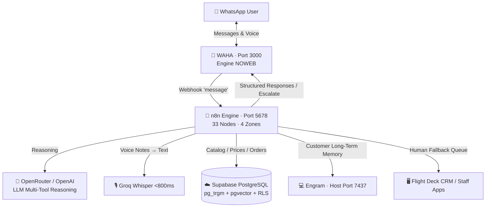
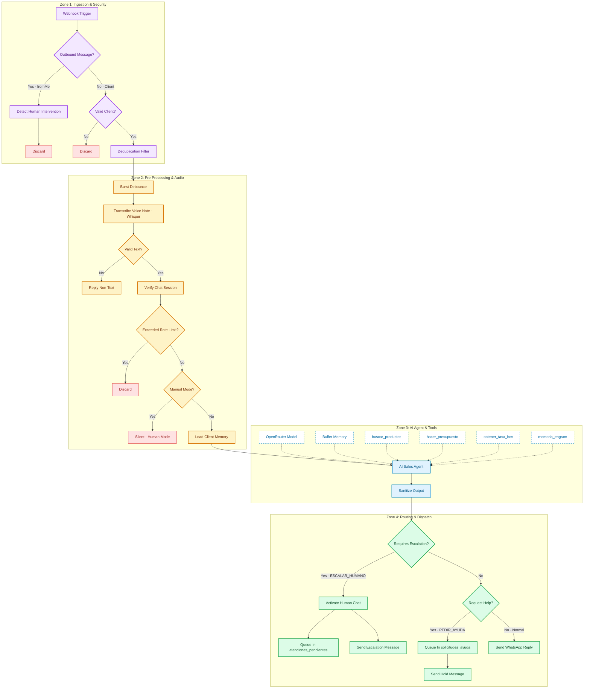

<div align="center">

  

  # WhatsApp AI Sales Agent

  <p align="center">
    <strong>Production-grade autonomous sales and customer support engine for WhatsApp.</strong><br>
    5-layer hybrid search, voice note transcription in &lt;800ms, persistent memory, and human escalation.
  </p>

  <p align="center">
    <a href="README.md"><strong>English</strong></a> · <a href="README.es.md"><strong>Español</strong></a>
  </p>

  <p align="center">
    <a href="https://nodejs.org/"></a>
    <a href="https://www.docker.com/"></a>
    <a href="https://n8n.io/"></a>
    <a href="https://supabase.com/"></a>
    <a href="https://nextjs.org/"></a>
    <a href="LICENSE"></a>
  </p>

</div>

---

## 🏗️ Architecture

Event-driven. WhatsApp messages arrive via WAHA, n8n orchestrates with LLMs via OpenRouter, queries PostgreSQL in Supabase, stores customer memory with Engram.


```mermaid
graph TD
    Client["📱 WhatsApp User"] <-->|"Messages & Voice"| WAHA["🐋 WAHA · Port 3000<br/>Engine NOWEB"]
    WAHA -->|"Webhook 'message'"| N8N["🐋 n8n Engine · Port 5678<br/>33 Nodes · 4 Zones"]
    N8N -->|"Reasoning"| Model["🧠 OpenRouter / OpenAI<br/>LLM Multi-Tool Reasoning"]
    N8N -->|"Voice Notes → Text"| Groq["🎙️ Groq Whisper <800ms"]
    N8N -->|"Catalog / Prices / Orders"| Supabase[("☁️ Supabase PostgreSQL<br/>pg_trgm + pgvector + RLS")]
    N8N -->|"Customer Long-Term Memory"| Engram["💻 Engram · Host Port 7437"]
    N8N -->|"Structured Responses / Escalate"| WAHA
    N8N -->|"Human Fallback Queue"| FlightDeck["🖥️ Flight Deck CRM / Staff Apps"]
```

### 🧰 Technology Stack

| Component | Technology | Purpose |
| --- | --- | --- |
| WhatsApp HTTP API | WAHA (Docker, engine NOWEB) | Multi-device session emulation and webhook delivery |
| Workflow Orchestrator | n8n (Docker) | Event management, state routing, rate limiting, and tool dispatch |
| LLM Reasoning | OpenRouter / OpenAI | Multi-turn reasoning and tool invocation |
| Voice Transcription | Groq Whisper | Audio note transcription in <800ms |
| Database & Search | Supabase (PostgreSQL + pg_trgm + pgvector) | Inventory catalog, order queue, and hybrid vector search |
| Long-Term Memory | Engram | Persistent cross-session customer facts and preferences |
| Flight Deck & CRM | Next.js 14 (App Router + Tailwind + GSAP + PWA) | Live telemetry, chat operations queue, RAG studio, DevOps console |
| Runtime | Node.js 22+ | CLI tools, sync guards, recovery engine |

---

## 🔍 The 5-Layer Hybrid Search Pipeline (RAG)

| # | Layer | Implementation | What It Resolves |
| --- | --- | --- | --- |
| 1 | Lexical AST | ilike + dimension parser (NxM, fractions, caliber) | Core queries in ~50ms without API cost (~70% of volume) |
| 2 | Catalog Dictionary | Inverted synonym table (catalogo_vocabulario) | Regional jargon and colloquialisms |
| 3 | Fuzzy Trigram | pg_trgm GIN similarity indexes | Severe typos, transposed letters |
| 4 | Vector Search | pgvector cosine similarity (text-embedding-3-small) | Phrasing variations |
| 5 | Semantic Recovery | LLM category classification & intent extraction | Customer describes the function of an item |
| ★ | Sales Popularity | Weighted purchase frequency | Reranks by purchase frequency |

Link to [RAG.md](RAG.md) and [ARCHITECTURE.md](ARCHITECTURE.md) for deep details.

---

## 🖥️ Flight Deck CRM & Operations Dashboard

<div align="center">
  
  <p align="center"><em>Previsualización interactiva de la consola de operaciones y CRM en tiempo real.</em></p>
</div>

<br />

<table border="0">
  <tr>
    <td width="30%" align="center" valign="middle">
      
    </td>
    <td width="70%" valign="top">
      The <code>dashboard/</code> directory contains a full-featured Next.js 14 companion application:
      <ul>
        <li><strong>Flight Deck</strong>: Real-time agent telemetry (latency, token costs, microservice topology map, streaming logs).</li>
        <li><strong>WhatsApp CRM</strong>: Live chat workspace with lead details, manual reply, and silent mode toggling.</li>
        <li><strong>RAG Studio</strong>: Interactive testing terminal to inspect the 5-layer retrieval engine in real time.</li>
        <li><strong>n8n Visualizer</strong>: Interactive node topology map across all 4 execution zones.</li>
        <li><strong>DevOps Console</strong>: Infrastructure operations terminal and tunnel monitor.</li>
      </ul>
    </td>
  </tr>
</table>

**Core Capabilities & Tooling:**
* **Authentication**: Supabase Auth with an instant Demo Mode for credential-free exploration.
* **Progressive Web App (PWA)**: Desktop & mobile installable, offline support via service workers, and VAPID web push alerts.
* **Modern UI/UX**: Dark obsidian theme, GSAP animations, Space Grotesk + JetBrains Mono typography, blueprint radar background.
* **Full Stack & Tests**: Next.js 14, React 18, Tailwind CSS, Lucide icons, Vitest unit tests, and Playwright E2E suites.
* **API Endpoints**: `/api/conversations`, `/api/n8n`, `/api/rag`, `/api/telemetry`, and `/api/tunnel`.
  
---

## 🤝 Human Escalation & Help Request System
- **Attention Queue** (`atenciones_pendientes`): When a customer asks to speak with a human, the bot queues them. Employees see real-time notifications via Supabase Realtime. One pending attention per phone (dedup). RLS-protected.
- **Help Requests** (`solicitudes_ayuda`): When the bot can't find a product or the customer disputes the result, it creates a help request. Employees select the correct products, and n8n automatically composes and sends the corrected response back to the customer via WhatsApp. Flow: pendiente → resuelto → enviado.
- **Web Push Notifications**: VAPID-based push to staff even with the app closed, via Supabase Edge Functions.

---

## 🗺️ n8n Workflow Topology (4 Zones)


```mermaid
flowchart TD
    classDef z1 fill:#f3e8ff,stroke:#9333ea,stroke-width:2px,color:#581c87;
    classDef z2 fill:#fef3c7,stroke:#d97706,stroke-width:2px,color:#78350f;
    classDef z3 fill:#e0f2fe,stroke:#0284c7,stroke-width:2px,color:#075985;
    classDef z4 fill:#dcfce7,stroke:#16a34a,stroke-width:2px,color:#14532d;
    classDef tool fill:#ffffff,stroke:#0284c7,stroke-dasharray: 4 4,color:#0369a1;
    classDef drop fill:#fee2e2,stroke:#dc2626,stroke-width:1px,color:#991b1b;

    subgraph ZONE1["Zone 1: Ingestion & Security"]
        W[Webhook Trigger]:::z1 --> S{Outbound Message?}:::z1
        S -->|Yes · fromMe| DH[Detect Human Intervention]:::z1 --> D1[Discard]:::drop
        S -->|No · Client| CR{Valid Client?}:::z1
        CR -->|No| D2[Discard]:::drop
        CR -->|Yes| AD[Deduplication Filter]:::z1
    end

    subgraph ZONE2["Zone 2: Pre-Processing & Audio"]
        AD --> DB[Burst Debounce]:::z2
        DB --> WH[Transcribe Voice Note · Whisper]:::z2
        WH --> TXT{Valid Text?}:::z2
        TXT -->|No| RNT[Reply Non-Text]:::z2
        TXT -->|Yes| CS[Verify Chat Session]:::z2
        CS --> RL{Exceeded Rate Limit?}:::z2
        RL -->|Yes| RLD[Discard]:::drop
        RL -->|No| MH{Manual Mode?}:::z2
        MH -->|Yes| MHA[Silent · Human Mode]:::drop
        MH -->|No| CM[Load Client Memory]:::z2
    end

    subgraph ZONE3["Zone 3: AI Agent & Tools"]
        CM --> AGENT["AI Sales Agent"]:::z3

        MODEL["OpenRouter Model"]:::tool -.-> AGENT
        MEM["Buffer Memory"]:::tool -.-> AGENT
        T1["buscar_productos"]:::tool -.-> AGENT
        T2["hacer_presupuesto"]:::tool -.-> AGENT
        T3["obtener_tasa_bcv"]:::tool -.-> AGENT
        T4["memoria_engram"]:::tool -.-> AGENT

        AGENT --> SAN["Sanitize Output"]:::z3
    end

    subgraph ZONE4["Zone 4: Routing & Dispatch"]
        SAN --> ESC{Requires Escalation?}:::z4
        ESC -->|Yes · ESCALAR_HUMANO| MAN[Activate Human Chat]:::z4
        MAN --> AP[Queue In atenciones_pendientes]:::z4
        MAN --> WA_ESC[Send Escalation Message]:::z4

        ESC -->|No| AYU{Request Help?}:::z4
        AYU -->|Yes · PEDIR_AYUDA| SA[Queue In solicitudes_ayuda]:::z4 --> WA_AYU[Send Hold Message]:::z4
        AYU -->|No · Normal| WA_RESP[Send WhatsApp Reply]:::z4
    end
```

---

## ⚙️ Auxiliary n8n Workflows

| Workflow | File | Purpose |
| --- | --- | --- |
| Auto-Improvement | `workflows/workflow_automejora.json` | Analyzes agent failures and automatically patches the system prompt or search logic |
| Help Request Forwarding | `workflows/workflow_reenviar_ayuda.json` | Composes and sends corrected product messages to customers after employee resolution |
| Vocabulary Builder | `workflows/workflow_vocabulario.json` | Generates and updates the catalog synonym dictionary from customer query patterns |

---

## 🗄️ Database Schema
Supabase PostgreSQL with RLS. Key tables:
- `productos` — Product catalog (SKU, description, price, stock, barcode)
- `tazas` — Dynamic exchange rates (BCV USD/EUR, Binance P2P)
- `clientes` — Customer registry
- `chat_sessions` — Bot/human state and rate limiting per phone
- `ventas` / `ventas_detalle` — Sales transactions
- `ordenes_cambio` / `ordenes_cambio_items` — Inventory adjustments
- `atenciones_pendientes` — Human escalation queue (Realtime-enabled)
- `solicitudes_ayuda` / `solicitudes_ayuda_items` — Help request queue (Realtime-enabled)
- `push_subscriptions` — Web Push notification subscriptions
- `servidores_tuneles` — Dynamic Cloudflare tunnel URL registry

Key database features: pg_trgm GIN indexes, pgvector cosine search, RLS policies (anon for bot, authenticated for employees), Supabase Realtime subscriptions, SECURITY DEFINER functions.

---

## ⚡ Quickstart & Setup

### 1. Clone & Configure
```bash
git clone https://github.com/Gus2708/whatsapp-agent.git
cd whatsapp-agent
cp .env.example .env
```
Edit `.env` with business branding (AGENT_NAME, STORE_NAME, STORE_LOCATION, STORE_SCHEDULE, STORE_CURRENCY) and API keys (WAHA_API_KEY, OPENROUTER_API_KEY, GROQ_API_KEY, SUPABASE_URL, SUPABASE_ANON_KEY, optionally OPENAI_API_KEY for pgvector embeddings).

### 2. Start Services via Docker
```bash
docker compose up -d
```
- WAHA Dashboard: http://localhost:3000 (scan QR code)
- n8n Automation: http://localhost:5678

### 3. Launch the Flight Deck CRM
```bash
cd dashboard && npm install
npm run dev
```
Open http://localhost:3001. Configure `dashboard/.env.local` from `dashboard/.env.example`.

### 4. Apply Database Schema
Run `supabase_schema.sql` in your Supabase SQL editor.

### 5. Generate Embeddings (optional, for pgvector layer)
```bash
node scripts/generar_embeddings.js
```

---

## 🧩 Single Source of Truth & Drift Protection
Search matcher lives canonically in `lib/catalog-search.js`. Guarded by:
```bash
npm test
```
- `check_sources_sync.js` — verifies lib/catalog-search.js matches scripts and live dumps
- `check_workflow_sync.js` — verifies n8n_workflow.json matches live system message and search nodes
- Dashboard: TypeScript strict checking + Vitest unit tests + Playwright E2E
- Root tests: catalog search, workflow guard, declared environments, paint/lamina search, recovery flow

---

## 🌿 Branches & Reference Implementations
- **`master`** (Default): Clean, 100% white-label open-source template
- **`perucho`**: Reference implementation for Ferretería El Serrucho (Venezuelan hardware store)

---

## 📁 Repository Structure

| Path | Purpose |
| --- | --- |
| `dashboard/` | Next.js Flight Deck CRM & Operations Dashboard (5 views, PWA, Supabase Auth) |
| `dashboard/components/crm/` | CRM workspace: conversation list, chat window, lead details |
| `dashboard/components/rag/` | RAG Studio: interactive search testing terminal |
| `dashboard/components/telemetry/` | KPI matrix, live log stream, microservices topology |
| `dashboard/components/n8n/` | n8n workflow visualizer |
| `dashboard/components/devops/` | DevOps console |
| `dashboard/components/auth/` | Auth provider + login screen (Supabase Auth + Demo Mode) |
| `dashboard/components/pwa/` | PWA service worker registration |
| `dashboard/app/api/` | Next.js API routes (conversations, n8n, rag, telemetry, tunnel) |
| `lib/catalog-search.js` | Canonical core search engine and AST normalizer |
| `rag.js` | RAG evaluation suite runner |
| `scripts/` | 120+ operational scripts: patches, tests, workflow builders, embedding generators |
| `workflows/` | Auxiliary n8n workflows (auto-improvement, help forwarding, vocabulary) |
| `n8n_workflow.json` | Complete export of the main n8n agent workflow |
| `data/business_context.example.json` | Template for custom business rules, hours, delivery zones |
| `docker-compose.yml` | Container definitions for WAHA and n8n |
| `supabase_schema.sql` | Full PostgreSQL schema with RLS, triggers, and functions |
| `boot.ps1` / `catchup.ps1` | Production background runner and offline message recovery engine |
| `waha_watchdog.ps1` | WAHA session health monitoring and auto-recovery |
| `tests/` | Node.js test:test suite (catalog, workflow, recovery, etc.) |
| `ARCHITECTURE.md` | Deep architectural whitepaper |
| `RAG.md` | RAG pipeline engineering benchmarks and tuning |
| `.env.example` | Root environment template |

---

## 📄 License

This project is licensed under the [MIT License](LICENSE).
