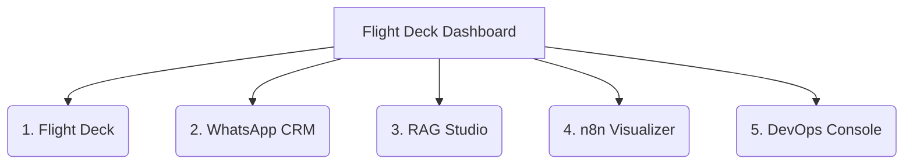

# WhatsApp AI Agent Flight Deck


**Package Name:** `whatsapp-agent-flightdeck`

A companion CRM and operations dashboard for the WhatsApp AI Sales Agent. Built with Next.js 14, React 18, Tailwind CSS, GSAP, and Supabase. Designed as a Progressive Web App (PWA) with offline support.

## 5 Operational Views

The app features a single-page layout with 5 tab views. You can navigate between them using keyboard shortcuts 1-5, and use 'M' for mute.



### 1. Flight Deck (Tab 1)
- **Real-time agent telemetry**
- **KPI Matrix component:** Displays messages processed, average latency, cost per message.
- **Microservices Topology Card:** Live status of WAHA, n8n, Supabase, and Engram services with health indicators.
- **Live Log Stream:** Streaming event log viewer.
- **Components:** `KpiMatrix.tsx`, `LiveLogStream.tsx`, `MicroservicesTopologyCard.tsx`

### 2. WhatsApp CRM (Tab 2)
- **Full conversation management workspace**
- **ConversationList.tsx:** Searchable, filterable list of WhatsApp conversations.
- **ChatWindow.tsx:** Real-time chat interface with message sending capability.
- **LeadDetailsPane.tsx:** Customer details and context.
- **CrmWorkspace.tsx:** Orchestrates the 3-panel layout.
- **Silent mode toggle:** Temporarily disable the bot per conversation (via WAHA API).
- **Data Source:** Real conversations loaded from Supabase + WAHA, with 10-second polling.
- **Demo mode:** Pre-loaded sample conversations for showcasing.

### 3. RAG Studio (Tab 3)
- **Interactive terminal** for testing the 5-layer search pipeline.
- Execute product queries against the live Supabase database.
- Inspect which search layers fired (Lexical, Synonym, Trigram, Vector, Semantic).
- View latencies, token costs, and confidence scores per result.
- **Component:** `RagStudio.tsx` (21KB)

### 4. n8n Visualizer (Tab 4)
- **Interactive visualization** of the 33-node n8n workflow.
- Color-coded zones (Purple=Ingestion, Yellow=PreProcessing, Blue=AI Agent, Green=Dispatch).
- **Component:** `N8nVisualizer.tsx`

### 5. DevOps Console (Tab 5)
- **Infrastructure operations terminal**
- **Component:** `DevOpsConsole.tsx`

## Architecture & Component Structure

```text
dashboard/
├── app/
│   ├── api/                   # Next.js API routes
│   │   ├── conversations/     # List, send messages, toggle silent mode
│   │   ├── n8n/               # Workflow telemetry proxy
│   │   ├── rag/               # Search execution proxy
│   │   ├── telemetry/         # KPI streaming
│   │   └── tunnel/            # Dynamic Cloudflare tunnel URLs
│   ├── layout.tsx             # Root layout (providers, fonts, PWA)
│   ├── page.tsx               # Main dashboard (FlightDeckDashboard)
│   └── globals.css            # Tailwind + custom theme
├── components/
│   ├── audio/                 # Sound effects provider
│   ├── auth/                  # AuthProvider + LoginScreen
│   ├── crm/                   # CRM workspace components
│   ├── devops/                # DevOps console
│   ├── hud/                   # Header navigation, blueprint canvas, actions menu
│   ├── icons/                 # Custom icon components
│   ├── n8n/                   # N8n workflow visualizer
│   ├── orbs/                  # Thinking orbs animation
│   ├── pwa/                   # PWA service worker registration
│   ├── rag/                   # RAG Studio terminal
│   └── telemetry/             # KPI, logs, topology
├── lib/
│   ├── constants.ts           # App constants & configuration
│   ├── types.ts               # TypeScript type definitions
│   ├── supabase.ts            # Supabase client setup
│   ├── tunnel.ts              # Dynamic tunnel URL resolution
│   ├── waha-client.ts         # WAHA API client
│   ├── crm-ui.ts              # CRM utility functions
│   ├── audio-synth.ts         # Audio synthesis utilities
│   ├── demoData.ts            # Demo mode sample data
│   └── live_buscar.js         # Live search function (synced from lib/)
├── public/
│   ├── manifest.webmanifest   # PWA manifest
│   ├── service-worker.js      # Offline cache & push notifications
│   ├── crmlogo.svg/png        # App icons
│   └── icon-*.png             # PWA icons (192, 512, maskable, apple-touch)
├── __tests__/                 # Vitest unit tests
├── e2e/                       # Playwright E2E tests
├── .env.example               # Environment template
├── vercel.json                # Vercel deployment config
├── tailwind.config.ts         # Custom theme (obsidian, chalk, gold, compass)
└── vitest.config.mts          # Test configuration
```

## Authentication
- **Supabase Auth:** Employee login required for production use.
- **Demo Mode:** Toggle available for showcasing without real credentials.
- `AuthProvider` wraps the entire app; `LoginScreen` shown when not authenticated.
- RLS policies ensure only active employees can access conversation data.

## PWA Features
- Installable on desktop (Chrome, Edge) and mobile (Android, iOS).
- Service worker with offline caching strategy.
- Web Push notifications to staff when customers escalate or need help.
- Custom app icons, splash screens, and screenshots for install prompt.
- **Categories:** business, productivity, utilities.

## Setup

### Prerequisites
- Node.js >= 22
- Running WhatsApp Agent stack (WAHA + n8n + Supabase)

### Install & Run
```bash
npm install
cp .env.example .env.local
# Edit .env.local with your credentials
npm run dev
```
Open http://localhost:3001

### Environment Variables
Refer to `.env.example`:
- `NEXT_PUBLIC_SUPABASE_URL` / `NEXT_PUBLIC_SUPABASE_ANON_KEY` — Supabase Auth & Database
- `SUPABASE_URL` / `SUPABASE_ANON_KEY` — Server-side Supabase access
- `NEXT_PUBLIC_AGENT_NAME` / `NEXT_PUBLIC_STORE_NAME` — White-label branding
- `N8N_API_URL` / `N8N_BASE_URL` / `N8N_API_KEY` — n8n telemetry
- `WAHA_API_KEY` / `WAHA_DASHBOARD_USERNAME` / `WAHA_DASHBOARD_PASSWORD` — WAHA API
- `OPENROUTER_API_KEY` / `OPENAI_API_KEY` — LLM & embeddings for RAG Studio

### Available Scripts

| Script | Command | Purpose |
| ------ | ------- | ------- |
| dev | `npm run dev` | Start development server (port 3001) |
| build | `npm run build` | Production build |
| start | `npm run start` | Production server (port 3001) |
| lint | `npm run lint` | ESLint |
| test | `npm run test` | Run Vitest unit tests |
| test:watch | `npm run test:watch` | Vitest watch mode |
| test:e2e | `npm run test:e2e` | Run Playwright E2E tests |
| typecheck | `npm run typecheck` | TypeScript strict check |

## UI Design System
- **Theme:** Dark obsidian background (`#0a0a0a`), chalk text, compass-gold accents.
- **Typography:** Space Grotesk (headings), Inter (body), JetBrains Mono (code/terminal).
- **Animation:** GSAP tab transitions, Thinking Orbs for loading states.
- **Layout:** Single-page app, max-width 1580px, responsive grid.
- **Background:** Blueprint radar canvas (always active).

## Testing
- **Unit Tests** (Vitest + Testing Library): CRM workspace, header actions, CRM UI utils, PWA registration, Tailwind scale consistency.
- **E2E Tests** (Playwright): PWA critical user journeys, RAG & n8n visualization flows.

## Deployment
- **Vercel:** `vercel.json` included, auto-detected as Next.js.
- **Self-hosted:** `npm run build && npm run start`
- Dashboard connects to the agent stack via environment variables (can be on same machine or separate).

## Related Documentation
- [Root README](../README.md) — Full project overview
- [Architecture](../ARCHITECTURE.md) — System architecture deep-dive
- [RAG Pipeline](../RAG.md) — Search pipeline benchmarks
- [Attention Queue Guide](../GUIA-APP-ATENCIONES.md) — Human escalation implementation
- [Help Request Guide](../GUIA-APP-SOLICITUDES-AYUDA.md) — Help request flow implementation
